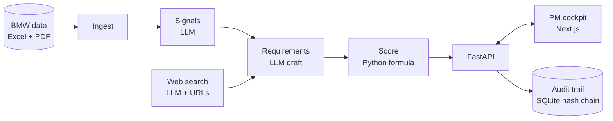

# Signal2Spec

> **From thousands of customer voices to a prioritized, evidence-backed requirement list for the next BMW, with the product manager in control of every decision and every change on a tamper-evident audit trail.**

Built at the TUM.ai × EHL Grand Finale 2026 for the **BMW Group challenge "AI for Product Decision Making"**.
Demo case: **BMW 5 Series (G60), USA**. Transferability shown with **BMW 1 Series (F70), Europe**.

## What it does

| Step | What happens | AI autonomous? | Human mandatory? |
|---|---|---|---|
| 1 Ingest | Customer feedback, customer study, sales volumes, option list → uniform *evidence* with stable IDs | code, no LLM | – |
| 2 Signals | Evidence → recurring complaints, unmet needs, delights (BMW taxonomy pre-grouping + LLM summary, citing evidence IDs) | yes | – |
| 3 Web | Competitor advantages and 3-5-year trends with URL, date and trust level | yes | – |
| 4 Requirements | Signals → customer-facing, measurable requirements with assumptions and uncertainties | proposes | **every requirement starts as `proposed`** |
| 5 Prioritization | Transparent weighted formula (customer pain, reach × 2030 sales, satisfaction gap, competitive pressure, future relevance, effort) × evidence confidence | formula, no LLM | PM may change weights (logged) |
| 6 Decision | approve · reject · edit · challenge (AI answers with evidence **and** counter-evidence) | answers challenges | **only the PM changes status; rationale required** |
| 7 Audit | Every change: who/what, when, why, before/after; SHA-256 hash chain + `verify` | automatic | – |

## Why it is different

1. **Evidence vs. assumption is explicit:** rule-based evidence level **A-D** per requirement, assumptions listed separately.
2. **Conflicting evidence is surfaced, not averaged** (e.g. "large display praised" vs. "touch-only controls distract").
3. **"Already offered?" check** against the official option list: sometimes the right requirement is a package, not a new feature.
4. **Explainable priority:** every score is a visible waterfall of factors; weights are adjustable live and audited.
5. **Adaptable:** a new vehicle or market is one JSON file in `config/scenarios/`.

## Challenge alignment

| Brief asks for | Where |
|---|---|
| Ingest provided data + enrich from the web | `src/backend/evidence_internal/`, `src/backend/evidence_external/` |
| Signals linked to sources | `Signal.evidence_ids` in `src/backend/core/models.py` |
| Clear, actionable, customer-facing requirements | `src/backend/requirements_engine/derive.py` |
| Prioritization logic you can explain | `src/backend/requirements_engine/scoring.py`, `evidence_level.py` |
| PM approves, rejects, edits, challenges | `POST /api/requirements/{id}/decision` in `src/backend/api/routes.py` |
| Complete audit trail | `src/backend/core/audit.py` (append-only, hash chain, `GET /api/audit/verify`) |
| Structured requirement list | `GET /api/scenarios/{id}/export` (CSV) |

## Architecture



Details and design decisions: [docs/ARCHITEKTUR.md](docs/ARCHITEKTUR.md). API: [src/shared/API.md](src/shared/API.md).

## Run it

```bash
python -m venv .venv
.venv\Scripts\activate            # macOS/Linux: source .venv/bin/activate
pip install -r requirements.txt
cp .env.example .env              # add your OPENAI_API_KEY (only needed for the pipeline)

# Without BMW data: the backend serves a synthetic example scenario
uvicorn main:app --app-dir src/backend --reload --port 8000     # http://localhost:8000/docs

# With BMW data in data/raw/ (not in git, the data is confidential):
python src/backend/pipeline.py --scenario G60-US

python -m pytest -q               # tests
```

## Data & privacy

BMW data is confidential and never committed (`data/` is git-ignored). Examples in `src/shared/beispiele/` are **synthetic**.
LLM answers are cached locally so the demo runs offline (`DEMO_MODUS=true`).

## Team

Five people, one lead and four parallel work paths: internal evidence, external evidence & evaluation, requirements & prioritization, PM cockpit.
Built with Claude Code; sessions recorded with Entire.
