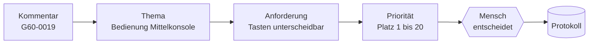
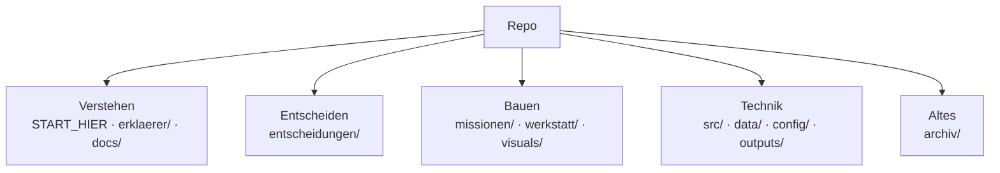

# Start hier

Du musst nichts programmieren können. Du musst nur verstehen, was wir bauen, und dir etwas aussuchen, das du übernimmst.

## 1. Schau dir zuerst das hier an (5 Minuten)

Öffne die Datei **`erklaerer/index.html`** per Doppelklick im Browser. Dort läuft ein echter Kundenkommentar durch unser ganzes Tool. Du kannst Regler verschieben, Entscheidungen treffen und einen Audit Trail fälschen. Danach verstehst du das Projekt.

## 2. Das Projekt in drei Sätzen

1. BMW hat tausende Kundenkommentare und will wissen, was das **nächste** Auto können muss.
2. Unser Tool liest die Kommentare, schlägt Anforderungen vor und sortiert sie nach Wichtigkeit.
3. Ein **Mensch** (der Produktmanager) entscheidet, und jede Entscheidung wird protokolliert.

Ein echtes Beispiel: Eine Kundin schreibt (Kommentar `G60-0019`), dass die Start/Stop-Taste zu nah an anderen Tasten liegt und sie nervös macht. Daraus wird ein Thema, daraus eine Anforderung, daraus eine Entscheidung. Den ganzen Weg erklärt [docs/04_techflow.md](docs/04_techflow.md).



## 3. Such dir deinen Weg aus

| Ich will … | Dann lies … | Dauer |
|---|---|---|
| verstehen, was wir machen | [`erklaerer/index.html`](erklaerer/index.html), dann [docs/01_projekt.md](docs/01_projekt.md) | 10 Minuten |
| wissen, was **ich** tun soll | [docs/05_rollen.md](docs/05_rollen.md) | 5 Minuten |
| **mitentscheiden** | [entscheidungen/ENTSCHEIDUNGSBOGEN.md](entscheidungen/ENTSCHEIDUNGSBOGEN.md) | 10 Minuten |
| ein Extra-Feature aussuchen | [entscheidungen/E04_features.md](entscheidungen/E04_features.md) | 5 Minuten |
| etwas bauen, ohne Code | [missionen/](missionen/README.md) | |
| Texte, Farben oder Features der App ändern | [src/frontend/baukasten/](src/frontend/baukasten/README.md) | 5 Minuten |
| die Werkbank ansehen | App starten, dann http://localhost:3000/studio (Bilder: `visuals/werkbank/`) | |
| wissen, was bis Sonntag fertig sein muss | [docs/06_roadmap.md](docs/06_roadmap.md) | 5 Minuten |
| ein Wort nachschlagen | [docs/02_glossar.md](docs/02_glossar.md) | |
| den Pitch üben | [docs/07_pitch.md](docs/07_pitch.md) | |

## 4. Wo liegt was?



Jeder Ordner hat eine eigene `README.md`, die sagt, was drin liegt und wer es braucht.

## 5. Drei Regeln

1. **Du entscheidest mit.** Alles, was nach Geschmack oder Strategie riecht, steht auf dem Entscheidungsbogen. Claude entscheidet das nicht für euch.
2. **Du schreibst nur in deinen Ordner** (`werkstatt/<dein-name>/`). Dort kannst du nichts kaputt machen.
3. **Schreib bei jeder Entscheidung ein Warum auf.** Die Jury bewertet, ob wir unsere Entscheidungen begründen können.

## Für den, der programmiert

App starten:
```
python -m venv .venv
.venv\Scripts\activate
pip install -r requirements.txt
uvicorn main:app --app-dir src/backend --port 8000
cd src/frontend && npm install && npm run dev
```
Dann http://localhost:3000. Mehr: `docs/SETUP.md`. Git-Regeln und Besitzregeln: `CLAUDE.md`.
