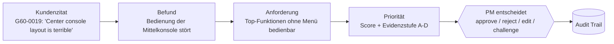

# START HIER

Eine Seite. Wenn du nur diese liest, weißt du, was wir bauen und was du jetzt tun kannst.

## Was wir bauen

**Signal2Spec** liest Kundenfeedback, Studien, Absatzzahlen, Optionslisten und Webquellen. Daraus schlägt es vor, was der nächste BMW 5er können muss, und sortiert die Vorschläge. Ein Produktmanager (PM) entscheidet, und jede Aktion landet in einem Audit Trail (Protokoll, das niemand heimlich ändern kann).

Unser Satz für den Pitch: **"Wir sagen nicht nur, WAS gebaut werden soll, sondern WIE SICHER wir uns sind und WARUM."**



Ein Beispiel mit echtem Zitat aus den Daten: Kommentar `G60-0019` sagt, die Start/Stop-Taste liege zu nah an anderen Tasten, das mache die Kundin nervös. Solche Kommentare werden zu Befunden, aus Befunden werden Anforderungen.

## Wo liegt was

| Ordner | Was drin ist | Wer braucht es |
|---|---|---|
| `entscheidungen/` | Offene Fragen als Karten. Hier antwortet ihr. | alle |
| `missionen/` | Eine Bauaufgabe pro Person, auch ohne Code | alle |
| `werkstatt/<name>/` | Dein eigener Platz zum Ausprobieren | du |
| `visuals/` | Diagramme, Charts, Mockups für Pitch und Demo | Pitch, Visual-Designer |
| `docs/` | Projekt, Glossar, Daten, Techflow, Rollen, Roadmap, Pitch (Nummern 01 bis 07) | alle |
| `src/backend/` | Python-Code der Pipeline und API | Builder |
| `src/frontend/` | Die Oberfläche (Next.js) | Builder, Lasse |
| `data/raw/` | BMW-Originaldaten, nie ändern | alle (lesen) |
| `data/processed/` | Ergebnisse der Pipeline | Builder |
| `outputs/` | Fertige Exporte: Anforderungsliste, Audit-Auszug | Abgabe |
| `archiv/` | Altes, das wir nicht löschen | niemand |

## Was ich jetzt tun kann

1. **Ich verstehe das Projekt noch nicht:** [docs/01_projekt.md](docs/01_projekt.md), dann [docs/04_techflow.md](docs/04_techflow.md). Zusammen 10 Minuten.
2. **Ein Wort ist unklar:** [docs/02_glossar.md](docs/02_glossar.md).
3. **Ich will mitentscheiden:** Öffne [entscheidungen/README.md](entscheidungen/README.md), lies eine Karte, trag Entscheidung und Warum ein.
4. **Ich will etwas bauen:** Such dir in [missionen/](missionen/README.md) eine Mission aus.
5. **Ich will wissen, was bis Sonntag zu tun ist:** [docs/06_roadmap.md](docs/06_roadmap.md).
6. **Ich will den Pitch üben:** [docs/07_pitch.md](docs/07_pitch.md).

## App starten (nur Builder)

```
python -m venv .venv
.venv\Scripts\activate
pip install -r requirements.txt
uvicorn main:app --app-dir src/backend --port 8000
cd src/frontend && npm install && npm run dev
```
Dann öffnen: http://localhost:3000. Die genaue Anleitung steht in `docs/SETUP.md`.

## Regeln in einem Satz

Alle pushen direkt auf `main`, jede Person schreibt nur in ihren Ordner, und nichts ist fertig ohne Beweis (Test oder Screenshot). Alles Weitere steht in `CLAUDE.md`.
