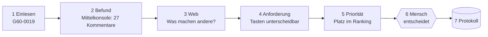

# 01 Das Projekt verstehen

Fragen und Antworten. Lies sie von oben nach unten.

## Was will BMW von uns?

BMW will eine App, die Produktmanagern hilft, **Anforderungen für ein Nachfolgemodell** abzuleiten, zu begründen und zu sortieren. Heute lesen Menschen dafür tausende Kommentare von Hand. Das dauert lange, und später weiß keiner mehr, warum etwas entschieden wurde.

Zwei Sätze aus dem Brief, nach denen die Jury uns misst:

> „Make clear where your conclusions are based on available evidence and where they rely on forward-looking assumptions.“
> (Zeig, was belegt ist und was nur Annahme über die Zukunft ist.)

> „… keeping the product manager firmly in control of every decision.“
> (Der Produktmanager behält jede Entscheidung.)

## Was bauen wir?

Eine Maschine mit sieben Schritten. Ein Beispiel läuft durch alle Schritte, damit du siehst, was passiert:

Jeder Schritt steht in [04_techflow.md](04_techflow.md) mit dem Beispiel. Zum Anfassen: `erklaerer/index.html`.

## Warum ist unsere Idee anders?

Andere Teams zeigen vermutlich eine Liste. Wir zeigen **wie sicher** jede Zeile ist.

| Wir zeigen … | Was das heißt | Echtes Beispiel |
|---|---|---|
| **Wie gut belegt** (Evidenzstufe A bis D) | A = viele Quellen sagen dasselbe. D = fast nur Annahme. | Eine Anforderung nur mit Webtrend und ohne Kundenzitat bekommt D. |
| **Widersprüche** | Wir mitteln nicht, wir zeigen beides. | Touchscreen: 35 Kommentare loben ihn, 23 kritisieren die Bedienung. |
| **Warum Platz 1** | Jede Rangzahl ist eine Formel, die man ändern kann. | Zählt „Reichweite“ mehr, ändert sich das Ranking live. |
| **Alles protokolliert** | Jede Entscheidung mit Begründung, nicht fälschbar. | Siehe Schritt 7 in `erklaerer/index.html`. |
| **„Gibt es das schon?“** | Wir vergleichen mit der offiziellen Optionsliste. | Manchmal ist die Antwort ein Paket, keine neue Funktion. |

## Was ist unser Demo-Fall?

BMW 5er (G60) in den USA. Die Datei hat 5.005 Kommentare, 4.365 davon aus den USA. Per Umschalter zeigen wir später 7er (G70) und 1er (F70), damit die Jury sieht, dass es für andere Modelle auch läuft.

## Was machen wir bewusst nicht?

Technik-Details, Gesetze, Preise und Business-Case. Das steht im Brief als „out of scope“. Der Code sortiert solche Vorschläge aus und sagt, warum.

## Wie steht es gerade?

| Teil | Stand |
|---|---|
| Rechenkern, Priorisierung, Protokoll, Challenge-Antwort | läuft, getestet |
| Startseite mit Rangliste | läuft |
| Detailseite, Entscheiden-Buttons, Protokoll-Seite | **fehlen noch** (Lasse) |
| Echte Befunde aus den Excel-Dateien | in Arbeit (Aditya) |
| 15 bis 25 Anforderungen | aktuell 8 (Dennis) |

Aktuelle Aufgaben pro Person: [05_rollen.md](05_rollen.md). Zeitplan: [06_roadmap.md](06_roadmap.md).
