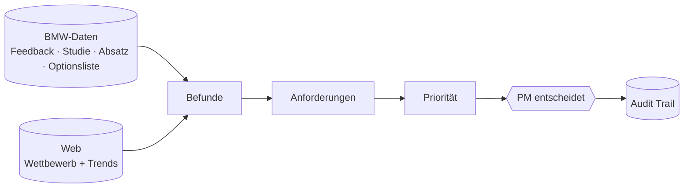

# 01 Projekt: Aufgabe, Idee, Demo-Fall

## Die Aufgabe von BMW

BMW will wissen, was das Nachfolgemodell eines Autos können muss. Heute lesen Menschen dafür tausende Kundenkommentare von Hand. Die Aufgabe: eine KI-App, die **Anforderungen ableitet, begründet und priorisiert**. Der Produktmanager (PM) bleibt bei jeder Entscheidung in Kontrolle.

Zwei Sätze aus dem Brief, die wir ernst nehmen:

> "Make clear where your conclusions are based on available evidence and where they rely on forward-looking assumptions."
> "We value trustworthy sources, transparent reasoning, thoughtful prioritization, and a clear understanding of uncertainty and conflicting evidence."

Der ganze Brief steht in `docs/CHALLENGE.md`.

## Unsere Idee

Was uns von anderen unterscheidet:

| # | Unterschied | Beispiel |
|---|---|---|
| 1 | Jede Anforderung zeigt, **wie gut sie belegt ist** (Evidenzstufe A bis D) | A = Zitate + Studie + Web passen zusammen. D = fast nur Annahme. |
| 2 | **Widersprüche werden gezeigt**, nicht wegmittelt | "Großes Display gelobt" und "Touch-Bedienung lenkt ab" stehen nebeneinander |
| 3 | **"Gibt es das schon?"-Check** gegen die Optionsliste | Manchmal ist die Antwort ein Paket, keine neue Funktion |
| 4 | **Priorität ist eine Formel**, die man live ändern kann | Gewichte per Regler, jede Änderung steht im Audit Trail |
| 5 | **Neues Modell oder Markt = eine JSON-Datei** | `config/scenarios/G70-US.json` |

## Demo-Fall

- **Hauptfall:** BMW 5er Limousine (G60) im US-Markt. Die Feedback-Datei hat 4.365 Zeilen mit Land US. 3.820 davon haben einen Feedback-Typ: Likes 1.694, Difficult to Use 1.217, Wants 532, Defect 377. (Die Docs nennen 3.610 für die bereinigte Menge. Welche Zahl die Pipeline wirklich nutzt, klärt Aditya in A1.)
- **Zweiter Fall:** G70 US (7er) und F70 (1er) per Szenario-Umschalter. Er zeigt, dass die Pipeline für andere Modelle läuft.
- **Nicht unser Thema** (laut Brief out of scope): Technik-Specs, Gesetze, Preis und Business-Case.

## Was heute schon läuft

Siehe `entscheidungen/SCHRITT0_BESTANDSAUFNAHME.md`. Kurz: Backend, Prüfpfad, Score-Formel, Challenge-Antwort und Liste im Cockpit laufen. Offen sind Detailseite, Entscheiden-Buttons, Audit-Seite und die echten Befunde aus den Excel-Dateien.
