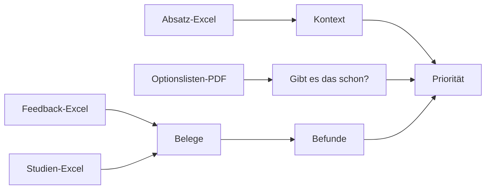

# 03 Daten: jede Datei, Inhalt, Beispiel, Nutzen

Alle BMW-Dateien liegen in `data/raw/`. **Nie ändern.** Alles, was wir daraus bauen, landet in `data/processed/`.

## Die Dateien

| Datei | Inhalt | Beispielzeile | Wofür wir sie nutzen |
|---|---|---|---|
| `G60_feedback_hackathon.xlsx` | 5.005 Kundenkommentare zum 5er, Spalten u. a. ID, Source, Country, Feedback Type, Customer Feedback, VFC-Themen | `G60-0019`, Source B, US, Wants, Thema "Center console, front": "Customer stated the center console layout is terrible. ... start/stop button being so close to the other buttons makes her nervous" | Rohstoff für Belege und Befunde (Pfad A) |
| `G70_feedback_hackathon.xlsx` | 4.690 Kommentare zum 7er (4.418 aus den USA) | gleiche Spalten | zweiter Fall G70-US |
| `F70_feedback_hackathon.xlsx` | 4.076 Kommentare zum 1er | gleiche Spalten | dritter Fall, Übertragbarkeit |
| `F70_G60_G68_G70_customer_studies.xlsx` | Blatt `US_2025`: je Attribut 7 Antwortstufen für G60 und G70. Blatt `CN_EU_2025`: Mittelwerte je Attribut für China und EU | G60 USA, "Operation of heater/ AC controls": 15,0 % unzufrieden (G70: 19,7 %) | Zufriedenheitslücke im Score, Gegencheck zu Kommentaren |
| `sales_volumes.xlsx` | Absatz je Markt (EU, CN, US, RoW) für 2024, 2025, 2030, je ein Blatt pro Modell | 5er USA: 75.600 / 78.000 / 80.000 | Reichweite im Score: viele Kunden zählen mehr |
| `G60_OptionList.PDF`, `G70_...`, `F70_...` | Offizielle Preislisten mit Serien- und Sonderausstattung, Paketen | (PDF, 23-28 Seiten) | "Gibt es das schon?"-Check (Pfad C) |
| `BMW_Hackathon_Briefing_Short.pdf`, `AI-BMV.pdf` | Der Brief und BMWs Prozessfolien | | Aufgabe, Pflicht-Deliverables |

## Wichtige Spalten im Feedback

| Spalte | Bedeutung | Werte (G60, US) |
|---|---|---|
| `Feedback Type` | Art des Kommentars | Likes 1.694 · Difficult to Use 1.217 · Wants 532 · Defect 377 |
| `Source` | Herkunft | B 2.627 · A 1.218 · C 384 · D 136 |
| `Vfc level2 Name` | BMW-Thema | größte Kritik-Themen siehe `visuals/charts/01_...png` |
| `Country` | Markt | US 4.365 von 5.005 Zeilen |

Auffällig: Viele Zeilen haben `no_class_found` als Thema (339 bei G60 US). Ohne BMW-Thema muss die KI das Thema selbst erkennen. Und Source B enthält Servicenotizen wie "Writer explained that ..." statt Kundenstimmen. Aditya sollte prüfen, ob die Evidenzstufe nach Quelle unterschiedlich zählt.

## Was daraus wird

| Stufe | Datei in `data/processed/<szenario>/` | Beispiel |
|---|---|---|
| Belege | `evidence.json` | `EV-G60-0019` |
| Kontext | `context.json` | Absatz, Studienwerte |
| Befunde | `signals.json` | `SIG-G60-US-001` |
| Web | `web_evidence.json`, `web_signals.json` | Wettbewerbsquelle mit URL und Vertrauensstufe |
| Anforderungen | `requirements.json` | `REQ-G60-US-001` |
| Bundle | `../G60-US.json` | alles zusammen, das die App lädt |

## Hinweis zu Beispieldaten

Die Dateien in `src/shared/beispiele/` sind **synthetisch** (ausgedacht, damit Tests ohne BMW-Daten laufen). Zahlen daraus wie "61 Kommentare" sind keine echten BMW-Zahlen. Echte Zahlen kommen nur aus `data/raw/`.

## Vertraulichkeit

Das Repo ist öffentlich, `data/raw/` liegt trotzdem drin (siehe Karte E08). Nichts davon in Tools außerhalb von Claude, GitHub und OpenAI hochladen.
