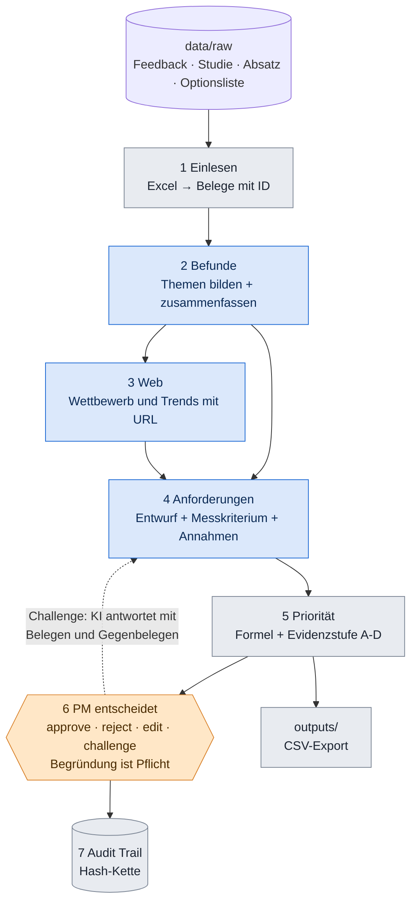

# 04 Techflow: der Weg der Daten

Blau = die KI arbeitet allein. Orange = der Mensch entscheidet. Grau = normaler Code, ohne KI.

**KI allein:** Schritte 2, 3, 4 (und die Challenge-Antwort). Auch dort gilt: Die KI darf nur IDs zitieren, die wir ihr gegeben haben.
**Mensch Pflicht:** Schritt 6. Jede Anforderung startet als `proposed`. Nur der PM ändert den Status.

Die fünf Fragen zu jedem Schritt. **"Mitgestalten"** zeigt, wo ihr ohne Code Einfluss habt.

---

## 1 Einlesen

| | |
|---|---|
| **Was passiert?** | Excel-Zeilen werden zu Belegen mit fester ID. Die Studie und die Absatzzahlen werden zu Kontext. |
| **Warum?** | Alles Weitere muss auf eine ID zeigen können, sonst gibt es keine Nachvollziehbarkeit. |
| **Wer?** | Code, keine KI. Pfad A (Aditya). `src/backend/evidence_internal/loaders.py` |
| **Was kommt raus?** | `evidence.json`. Beispiel: Kommentar `G60-0019` ("Center console layout is terrible ... start/stop button so close to the other buttons") wird zu `EV-G60-0019`. |
| **Fertig, wenn …** | Die Zahl der Belege passt zur Zahl der Excel-Zeilen, und `python -m pytest tests/pfad_a -q` ist grün. |
| **Mitgestalten** | Welche Zeilen zählen? Z. B. Source B enthält Servicenotizen. Eure Regel dazu (Daten-Detektiv, siehe `missionen/`). |

## 2 Befunde

| | |
|---|---|
| **Was passiert?** | Belege werden nach BMW-Thema (VFC) vorgruppiert. Pro Gruppe fasst die KI zusammen und nennt die Beleg-IDs. Widersprechende Befunde werden verknüpft. |
| **Warum?** | 4.365 Kommentare einzeln an die KI zu geben, wäre teuer und nicht erklärbar. Gruppen sind es. |
| **Wer?** | Code gruppiert, KI fasst zusammen. Pfad A. `evidence_internal/signals.py` |
| **Was kommt raus?** | `signals.json`. Ein Befund hat Art (complaint, unmet_need, delight, competitor_advantage, trend), Titel, `evidence_ids`, Anzahl Nennungen, `conflicts_with`. |
| **Fertig, wenn …** | Jede `evidence_id` eines Befunds existiert wirklich (Test), und die Konfliktliste enthält mindestens einen echten Widerspruch. |
| **Mitgestalten** | Eigene Kategorien und der Zusammenfassungs-Prompt. |

## 3 Web

| | |
|---|---|
| **Was passiert?** | 13 feste Fragen (8 Wettbewerb, 5 Trend 2028-2031) gehen an die KI mit Websuche. Jede Aussage braucht eine URL. Jede Quelle bekommt eine Vertrauensstufe (high, medium, low) allein aus der Domain. |
| **Warum?** | Der Brief will "trustworthy sources" und einen Blick 3 bis 5 Jahre voraus. Forum-Stimmen sollen Befunde nicht verfälschen. |
| **Wer?** | KI mit Websuche, Regeln für Vertrauen. Pfad B (Piyush). `evidence_external/` |
| **Was kommt raus?** | `web_evidence.json`, `web_signals.json`. Quellen mit `low` bleiben sichtbar, fließen aber in keinen Befund. |
| **Fertig, wenn …** | Jeder Webbeleg hat URL und Datum, und `python -m pytest tests/pfad_b -q` ist grün. |
| **Mitgestalten** | Die Fragen und die Wettbewerber-Liste (Wettbewerbs-Scout). |

## 4 Anforderungen

| | |
|---|---|
| **Was passiert?** | Aus Befunden entwirft die KI Anforderungen: Titel, Beschreibung, messbares Kriterium, Annahmen. Ein Scope-Wächter sortiert Technik, Gesetze und Preise aus. Dazu der Check "Gibt es das schon?" gegen die Optionsliste. |
| **Warum?** | Der Brief will "clear, actionable, customer-facing" Anforderungen. Out-of-scope-Vorschläge werden mit Grund zurückgegeben, nicht stillschweigend gelöscht. |
| **Wer?** | KI schlägt vor, Code prüft. Pfad C (Dennis). `requirements_engine/derive.py`, `offer_check.py` |
| **Was kommt raus?** | `requirements.json`. Beispiel-Form (synthetisch): `REQ-G60-US-001` "Physische Bedienelemente für Top-Funktionen", Kriterium "im Probandentest >= 80 % blind bedienbar", Status `proposed`. |
| **Fertig, wenn …** | 15 bis 25 Anforderungen, jede mit `signal_ids`, Kriterium und mindestens einer Annahme. Zurzeit 8. |
| **Mitgestalten** | **Der Prompt.** Das ist der größte Hebel für die Textqualität (Prompt-Designer). |

## 5 Priorität

| | |
|---|---|
| **Was passiert?** | Sechs Faktoren (0 bis 1) werden gewichtet addiert. Danach wird mit der Sicherheit der Evidenzstufe multipliziert (A = 1,0 · B = 0,85 · C = 0,7 · D = 0,5). |
| **Warum?** | Die KI vergibt keine Punkte, weil Modelle schwanken. Eine Formel ist jedes Mal gleich und erklärbar. |
| **Wer?** | Code. Pfad C. `scoring.py`, `evidence_level.py`, `factors.py` |
| **Was kommt raus?** | Score, Rang und ein Wasserfall pro Anforderung ("Kundenschmerz trägt 20 Punkte bei, weil ..."). |
| **Fertig, wenn …** | Gleiche Eingabe gibt immer gleichen Score (`tests/test_scoring.py`), und der Wasserfall summiert sich auf den Score. |
| **Mitgestalten** | **Die Gewichte** (Karte E05). Eure Begründung ist wichtiger als die Zahl. |

## 6 PM entscheidet

| | |
|---|---|
| **Was passiert?** | Im Cockpit sieht der PM Liste, Detail, Zitate, Quellen und Annahmen. Er kann freigeben, ablehnen, bearbeiten oder hinterfragen. Ohne Begründung geht nichts. |
| **Warum?** | Das ist der Kern der Aufgabe: "keeping the product manager firmly in control". |
| **Wer?** | Mensch. Cockpit von Pfad D (Lasse), Backend von Piyush. `POST /api/requirements/{id}/decision` |
| **Was kommt raus?** | Neuer Status (`approved`, `rejected`, `edited`, `challenged`) plus ein Audit-Eintrag. |
| **Fertig, wenn …** | Klick auf "Freigeben" ohne Begründung wird abgelehnt, mit Begründung steht der Eintrag im Audit Trail. |
| **Mitgestalten** | Aussehen, Texte der Buttons, die Challenge-Fragen (Visual-Designer, Story & Pitch). |

## 7 Audit Trail

| | |
|---|---|
| **Was passiert?** | Jede Änderung wird als Zeile gespeichert: wer, was, wann, warum, vorher, nachher. Jede Zeile enthält den Hash der vorigen. |
| **Warum?** | BMW will alles nachvollziehen können, bis zum Originalzitat. Wer etwas ändert, bricht die Kette. |
| **Wer?** | Code. `core/audit.py`, `GET /api/audit/verify` |
| **Was kommt raus?** | `data/audit.db` und ein CSV-Export in `outputs/`. |
| **Fertig, wenn …** | `verify` meldet "gültig", und eine absichtlich geänderte Zeile wird erkannt (`tests/test_audit.py`). |
| **Mitgestalten** | Die Audit-Ansicht: wie lesbar ist die Geschichte einer Anforderung? |
