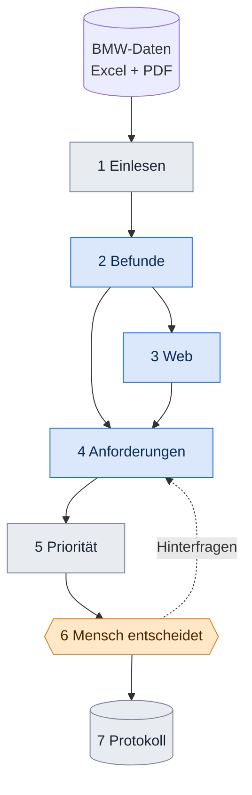

# 04 Techflow: die Reise eines Kommentars

Wir folgen **einem echten Kommentar** durch die ganze Maschine. Danach kannst du jeden Schritt erklären.
Zum Anfassen gibt es dasselbe in `erklaerer/index.html`.

**Farben:** blau = die KI arbeitet, grau = normaler Code, orange = ein Mensch entscheidet.

## Unser Beispiel

> „Customer stated the center console layout is terrible. Customer stated the start/stop button being so close to the other buttons makes her nervous and she feels it is not safe.“
> Kommentar `G60-0019`, USA, Typ „Wants“ (Wunsch).

---

## Schritt 1: Einlesen

**Stell dir vor:** Eine Excel-Zeile bekommt einen Namensschild-Aufkleber, damit man sie immer wiederfindet.

| | |
|---|---|
| **Was passiert** | Jede Zeile wird ein *Beleg* mit fester ID. Aus `G60-0019` wird `EV-G60-0019`. |
| **Wer** | Normaler Code, keine KI. Person: Aditya. |
| **Warum** | Alles Spätere zeigt auf diese ID zurück. So kann man am Ende nachsehen: „Woher kommt das?“ |
| **Ergebnis** | Datei `evidence.json` mit allen Belegen. |
| **Fertig, wenn** | Die Zahl der Belege passt zur Zahl der Excel-Zeilen. |

**Du entscheidest mit:** Quelle B enthält viele Service-Notizen („Writer explained …“) statt Kundenstimmen. Sollen sie voll, halb oder gar nicht zählen? (Mission Daten-Detektiv)

## Schritt 2: Befunde

**Stell dir vor:** Du legst 27 Zettel zum selben Thema auf einen Stapel und schreibst einen Satz oben drauf.

| | |
|---|---|
| **Was passiert** | BMW hat jeden Kommentar schon einem Thema zugeordnet. Zu „Center console, front“ gibt es **27** US-Kommentare: 12 „schwer zu bedienen“, 6 Wünsche, 5 Lob, 4 Defekte. Die KI liest den Stapel und schreibt **einen Befund-Satz**, z. B. „Tasten der Mittelkonsole sind schwer zu unterscheiden und geben kaum Rückmeldung.“ Dazu nennt sie die IDs, auf die sie sich stützt. |
| **Wer** | Code bildet die Stapel, KI schreibt den Satz. Person: Aditya. |
| **Warum Stapel** | 4.365 Kommentare einzeln an die KI zu geben wäre teuer und nicht nachvollziehbar. |
| **Ergebnis** | Datei `signals.json`. Jeder Befund hat Art (Beschwerde, Wunsch, Lob, Wettbewerbsvorteil, Trend), Titel, Beleg-IDs und Konflikte. |
| **Fertig, wenn** | Jede genannte ID gibt es wirklich (ein Test prüft das), und ein echter Widerspruch ist markiert. |

**Der Widerspruch, den wir zeigen statt wegzumitteln:** Zum Thema „Touch screen, operation“ gibt es 64 Kommentare. **35 loben** („the vehicle's touchscreen is excellent“, `G60-0160`), **23 kritisieren** („way too many main icons and then even more sub menus“, `G60-0914`). Beide Seiten stehen nebeneinander in der App.

**Du entscheidest mit:** Welche Kategorien gibt es (Bedienung, Laden, Platz …)? Wie klingt der Befund-Satz? (Das ist ein Prompt, also Text.)

## Schritt 3: Web

**Stell dir vor:** Eine Praktikantin soll herausfinden, was Mercedes und Audi zum Thema machen, und zu jeder Aussage den Link legen.

| | |
|---|---|
| **Was passiert** | 13 feste Fragen (8 zu Wettbewerbern, 5 zu Trends 2028 bis 2031) gehen an die KI mit Websuche. Jede Aussage braucht eine URL. Ein Programm vergibt dann ein Vertrauen (high, medium, low), nur anhand der Domain. |
| **Wer** | KI sucht, Regel bewertet. Person: Piyush. |
| **Warum eine Regel** | Eine KI würde bei jedem Lauf anders urteilen. Die Regel ist immer gleich und erklärbar. |
| **Ergebnis** | `web_evidence.json`, `web_signals.json`. Quellen mit „low“ bleiben sichtbar, zählen aber nicht. |
| **Fertig, wenn** | Jede Aussage hat URL und Datum. |

**Du entscheidest mit:** Welche Wettbewerber, welche Themen zuerst? Du kannst selbst recherchieren (Mission Wettbewerbs-Scout), wir vergleichen mit der KI.

## Schritt 4: Anforderung

**Stell dir vor:** Aus „Kunden meckern über die Tasten“ wird ein Auftrag, den ein Entwickler versteht und ein Tester prüfen kann.

| | |
|---|---|
| **Was passiert** | Die KI schreibt aus dem Befund: Titel, Beschreibung, **Messkriterium**, Annahmen. Ein Code-Wächter sortiert aus, was nicht erlaubt ist (Technik, Gesetze, Preise) und sagt, warum. Dazu kommt der Check „Gibt es das schon?“ gegen die Optionsliste. |
| **Wer** | KI schreibt, Code prüft. Person: Dennis. |
| **Beispiel (zur Erklärung, die KI formuliert eigene)** | Titel: „Tasten sind unterscheidbar und geben spürbare Rückmeldung.“ Kriterium: „Im Test finden 80 % die Start/Stop-Taste blind.“ Annahme: „Der Wunsch nach Tasten bleibt bis 2030.“ Status: `proposed`. |
| **Ergebnis** | `requirements.json`. Ziel: 15 bis 25 Anforderungen. Aktuell 8. |
| **Fertig, wenn** | Jede Anforderung hat Belege, ein Kriterium und mindestens eine Annahme. |

**Du entscheidest mit:** Der **Prompt** bestimmt, wie die Texte klingen. Wer ihn verbessert, verbessert alles. (Mission Prompt-Designer)

## Schritt 5: Priorität

**Stell dir vor:** Eine Jury vergibt Punkte für sechs Dinge. Du bestimmst, welches Ding wie viel zählt.

| | |
|---|---|
| **Was passiert** | Sechs Faktoren (je 0 bis 1) werden mit Gewichten addiert. Danach wird mit der **Sicherheit** multipliziert: A = 1,0 · B = 0,85 · C = 0,7 · D = 0,5. Schlecht Belegtes rutscht also nach unten, bleibt aber sichtbar. |
| **Die sechs Faktoren (Standard-Gewicht)** | Kundenschmerz 25 % · Reichweite 20 % · Zufriedenheitslücke 20 % · Wettbewerbsdruck 15 % · Zukunft 10 % · Aufwand 10 % |
| **Wer** | Normaler Code, **keine KI**. Person: Dennis. |
| **Warum keine KI** | Der Produktmanager muss jeden Punkt verstehen und ändern können. Eine Formel ist jedes Mal gleich. |
| **Echtes Zahlenbeispiel** | Reichweite: 5er USA wurden 78.000 Stück 2025 verkauft, Prognose 2030: 80.000. Zufriedenheitslücke: 15,0 % der US-Befragten sind unzufrieden mit „Operation of heater/ AC controls“. |
| **Ergebnis** | Score und Rang, dazu ein **Wasserfall** („Kundenschmerz bringt 22 Punkte, Reichweite 16 …“). |
| **Fertig, wenn** | Gleiche Eingabe ergibt immer denselben Score, und der Wasserfall summiert sich auf den Score. |

**Du entscheidest mit:** **Die Gewichte.** Das ist die wichtigste Entscheidung des Projekts. Probiere sie in `erklaerer/index.html` aus.

## Schritt 6: Der Mensch entscheidet

**Stell dir vor:** Der Produktmanager hat die Liste vor sich und kann jeden Eintrag annehmen, ablehnen, ändern oder hinterfragen.

| | |
|---|---|
| **Was passiert** | Vier Aktionen: freigeben, ablehnen, bearbeiten, hinterfragen. Eine **Begründung ist Pflicht**. Beim Hinterfragen („Ist das nur Gewohnheit?“) antwortet die KI mit Belegen **und** Gegenbelegen. |
| **Wer** | Der Mensch. Die Oberfläche baut Lasse. |
| **Warum** | Das ist der Kern der Aufgabe: Der Produktmanager behält die Kontrolle. |
| **Ergebnis** | Neuer Status plus ein Protokoll-Eintrag. |
| **Fertig, wenn** | Freigeben ohne Begründung wird abgelehnt. |

## Schritt 7: Protokoll (Audit Trail)

**Stell dir vor:** Ein Heft, in dem jede Zeile auf die vorige zeigt. Reißt jemand eine Seite raus, fällt es auf.

| | |
|---|---|
| **Was passiert** | Jede Aktion wird als Zeile gespeichert: wer, was, wann, warum, vorher, nachher. Jede Zeile enthält den Fingerabdruck (Hash) der Zeile davor. |
| **Wer** | Code. |
| **Warum** | BMW will alles nachvollziehen können, bis zum Original-Kommentar. |
| **Ergebnis** | `data/audit.db` und ein CSV-Export. |
| **Fertig, wenn** | „Prüfen“ meldet gültig, und eine absichtliche Fälschung wird erkannt. Probier das in `erklaerer/index.html`. |

---

## Wo kannst du überall mitgestalten?

| Schritt | Dein Hebel | Mission |
|---|---|---|
| 1 | Welche Kommentare zählen | Daten-Detektiv |
| 2 | Kategorien und Befund-Sätze | Daten-Detektiv |
| 3 | Wettbewerber und Themen | Wettbewerbs-Scout |
| 4 | Der Prompt für Anforderungen | Prompt-Designer |
| 5 | Die Gewichte | alle (Entscheidungsbogen) |
| 6 | Aussehen und Texte der Buttons | Visual-Designer |
| 7 | Wie lesbar das Protokoll ist | Visual-Designer |
