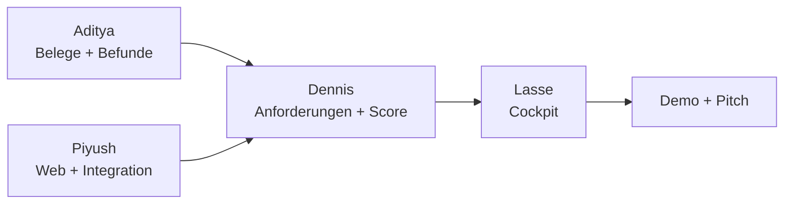

# 05 Rollen: wer macht was

Zwei Ebenen: **Pfad** (Code, Tests, Ordner, wie bisher) und **Mission** (eine sichtbare Aufgabe, auch ohne Code). Vorschlag aus Karte E06. Das Team kann ihn ändern.

| Person | Pfad (Ordner) | Mission | Landet in |
|---|---|---|---|
| **Piyush** (@PiyushPapaya) | Lead + B Web: `core/`, `api/`, `pipeline.py`, `evidence_external/`, `config/`, `docs/` | [Story & Pitch](../missionen/story-und-pitch.md) + [Builder](../missionen/builder.md) | Pitch, Abgabe |
| **Aditya** (@AdiAvocado) | A Interne Evidenz: `evidence_internal/`, `tests/eval/` | [Daten-Detektiv](../missionen/daten-detektiv.md) | Folie "Vertrauen", Eval-Zahl |
| **Dennis** (@Di0n-0) | C Anforderungen: `requirements_engine/` | [Prompt-Designer](../missionen/prompt-designer.md) | Challenge-Dialog, Anforderungstexte |
| **Lasse** (@JoleEight) | D Cockpit: `src/frontend/` | [Visual-Designer](../missionen/visual-designer.md) | Oberfläche, Deck, Backup-Video |
| **Wer mag** | – | [Wettbewerbs-Scout](../missionen/wettbewerbs-scout.md) | Webquellen in der App |

Regeln dazu stehen in `CLAUDE.md`: nur im eigenen Ordner schreiben, Signaturen im Kopf jeder Datei nicht ändern, geteilte Dateien nur Piyush.

Wer im Pitch was sagt: `docs/07_pitch.md`.
