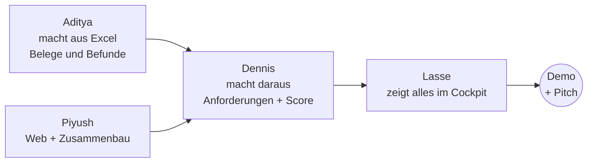

# 05 Rollen: Was ist mein Job?

Jede Person hat zwei Dinge:
- einen **Pfad**: ihr Teil der Maschine. Dort schreibt nur sie, damit niemand sich in die Quere kommt.
- eine **Mission**: etwas Sichtbares für Demo oder Pitch. Die meisten Missionen brauchen keinen Code.

Das ist der Datenfluss. Du siehst: **Jede Person liefert der nächsten etwas.** Bis die echte Datei da ist, nimmt jeder ein Beispiel (`src/shared/beispiele/`), deshalb muss niemand warten.

---

## Aditya: der Daten-Detektiv

**Dein Job in einem Satz:** Du holst aus den Excel-Dateien heraus, was Kunden wirklich sagen.

| | |
|---|---|
| **Pfad** | Interne Daten (`src/backend/evidence_internal/`, Schritt 1 und 2) |
| **Mission** | [Daten-Detektiv](../missionen/daten-detektiv.md): Finde von Hand die 15 bis 25 stärksten Kundenthemen mit besten Zitaten. Dann vergleichen wir mit der KI. |
| **Heute** | Studie und Absatzzahlen einlesen, echte Befunde aus der KI holen |
| **Das entscheidest du** | Welche Kommentare zählen (z. B. Service-Notizen in Quelle B)? Welche Themen sind „stark“? |
| **Im Pitch** | Die **Vertrauens-Zahl**: „Von 20 Themen, die wir von Hand fanden, hat die KI 17 gefunden.“ |
| **Du bist fertig, wenn** | Echte Befund-Datei da, Tabelle mit Themen und Zitat-IDs fertig, Vergleichszahl steht |

## Dennis: der Prompt-Designer

**Dein Job in einem Satz:** Du bestimmst, wie die KI aus Befunden gute Anforderungen schreibt.

| | |
|---|---|
| **Pfad** | Anforderungen und Score (`src/backend/requirements_engine/`, Schritt 4 und 5) |
| **Mission** | [Prompt-Designer](../missionen/prompt-designer.md): Schreib und teste die Anweisungen an die KI. Das ist Bauen ohne Code. |
| **Heute** | Von 8 auf 15 bis 25 Anforderungen kommen, Textqualität verbessern |
| **Das entscheidest du** | Wie klingt eine gute Anforderung? Wie antwortet die KI, wenn der Produktmanager sie hinterfragt? |
| **Im Pitch** | Priorisierung erklären und auf Jury-Fragen dazu antworten („Warum nicht die KI?“) |
| **Du bist fertig, wenn** | 15+ Anforderungen mit Belegen, Kriterium und Annahme; drei gute Challenge-Antworten für die Demo |

## Lasse: der Visual-Designer

**Dein Job in einem Satz:** Du baust die Oberfläche, die der Produktmanager in der Demo bedient, und sorgt dafür, dass sie gut aussieht.

| | |
|---|---|
| **Pfad** | Cockpit (`src/frontend/`, Schritt 6) |
| **Mission** | [Visual-Designer](../missionen/visual-designer.md): Diagramme, Mockups, das Aussehen. Startpunkt liegt in `visuals/`. |
| **Heute** | Detailseite, Entscheiden-Buttons mit Pflicht-Begründung, Protokoll-Seite |
| **Das entscheidest du** | Stil und Look (Karte E03), welche Extra-Features sichtbar werden (E04) |
| **Im Pitch** | Du klickst die Demo. Piyush spricht dazu. |
| **Du bist fertig, wenn** | Der Klickpfad aus [07_pitch.md](07_pitch.md) läuft dreimal ohne Fehler, und ein Backup-Video existiert |

## Piyush: Story, Web und Zusammenbau

**Dein Job in einem Satz:** Du hältst alles zusammen, recherchiert im Netz und gibst am Ende ab.

| | |
|---|---|
| **Pfad** | Lead + Web (`core/`, `api/`, `pipeline.py`, `evidence_external/`, Schritt 3 und die Verbindung aller Schritte) |
| **Mission** | [Story & Pitch](../missionen/story-und-pitch.md) und [Builder](../missionen/builder.md) |
| **Heute** | Pipeline auf echten Daten durchlaufen lassen, Deck, Abgabe vorbereiten |
| **Das entscheidest du** | Wie der Pitch beginnt, was gekürzt wird, wenn die Zeit knapp ist |
| **Im Pitch** | Problem, Lösung, Live-Demo-Sprecher, Schluss |
| **Du bist fertig, wenn** | Abgabe auf ehl.gg mit grüner CI und Entire-Checkpoints |

## Und wenn ich etwas anderes machen will?

Dann sag es. Die Aufteilung ist ein Vorschlag (Karte E06). Auch eine **fünfte Mission** ist offen: [Wettbewerbs-Scout](../missionen/wettbewerbs-scout.md). Wer Lust auf Recherche hat, nimmt sie.

## Die Regeln, damit wir uns nicht in die Quere kommen

- Du schreibst nur in **deinen Pfad-Ordner** und in `werkstatt/<dein-name>/`.
- Brauchst du etwas aus einem fremden Ordner, sag es der Person oder Piyush.
- Die Kopfzeile jeder Code-Datei (die „Signatur“) bleibt unverändert, weil andere sich darauf verlassen.
