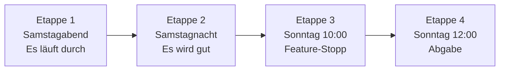

# 06 Roadmap: der Spielplan bis Sonntag 12:00

Vier Etappen. Bei jedem Punkt steht, **wer** es macht und **warum** es zählt.
**MUSS** = BMW verlangt es, oder ohne das gibt es keine Demo. **KANN** = Bonus.
Wo ihr entscheidet, steht **Entscheidung**.

## Die vier Pflichten von BMW

| # | Pflicht | Wo sie erfüllt wird | Stand |
|---|---|---|---|
| 1 | Prototyp: Daten → Anforderungen → Priorität → Entscheidung | die ganze App | Kern läuft, Cockpit unvollständig |
| 2 | 15 bis 25 Anforderungen mit ID, Belegen, Score, Begründung, Evidenzstufe, Annahmen, Status | `requirements.json` | 8 |
| 3 | Workflow-Bild: KI allein vs. Mensch | `visuals/techflow.png` | fertig |
| 4 | Protokoll bis zum Original-Zitat | Protokoll-Seite | Daten da, Seite fehlt |

---

## Etappe 1: Samstagabend · Es läuft durch

**Ziel:** Ein Kommentar geht von Excel bis zur Entscheidung, mit echten BMW-Daten.

| | Aufgabe | Wer | Warum |
|---|---|---|---|
| MUSS | Echte Belege und Befunde aus allen Excel-Dateien | Aditya | Ohne echte Daten ist alles nur Beispiel |
| MUSS | Anforderungen aus den echten Befunden | Dennis | Das ist unser Hauptprodukt |
| MUSS | Pipeline läuft von Anfang bis Ende für G60-US | Piyush | Verbindet alle Teile |
| MUSS | Detailseite: Wasserfall, Zitate, Quellen | Lasse | Hier sieht man die Beweiskette |
| MUSS | Entscheiden mit Pflicht-Begründung, Protokoll-Seite | Lasse | Kern der Aufgabe |
| MUSS | **Erste Abgabe** auf ehl.gg | Piyush | Sicherheitsnetz |
| MUSS | **Entscheidung:** Entscheidungsbogen ausfüllen | alle | Sonst entscheidet Claude, nicht ihr |
| KANN | Konflikte zwischen Befunden | Aditya | Zeigt Unsicherheit, gefällt der Jury |
| KANN | Gewichte-Regler im Cockpit | Lasse | Mehr Kontrolle für den Produktmanager |

## Etappe 2: Samstagnacht · Es wird gut

**Ziel:** 15+ gute Anforderungen, zweites Modell, Pitch-Gerüst. Immer mindestens zwei Personen wach.

| | Aufgabe | Wer | Warum |
|---|---|---|---|
| MUSS | 15 bis 25 Anforderungen, Texte schärfen | Dennis | BMW-Pflicht Nr. 2 |
| MUSS | Offline-Test: App läuft ohne Internet (`DEMO_MODUS=true`) | Piyush | Saal-WLAN fällt oft aus |
| MUSS | Vertrauens-Zahl: Stichprobe von Hand mit KI vergleichen | Aditya | Unsere stärkste Folie |
| MUSS | Demo-Klickpfad dreimal ohne Fehler | Lasse | Sonst peinlich vor der Jury |
| MUSS | Deck v1 | Piyush | Pitch ist 25 % der Wertung |
| KANN | Zweites Modell (G70 oder F70) | Aditya, Piyush | Zeigt „übertragbar“ |
| KANN | Eigene Extra-Features aus dem Menü | wer will | Hebt uns ab (siehe E04) |
| KANN | **Missionen** fertig: Tabelle, Prompts, Bilder | alle | Macht den Pitch persönlich |

## Etappe 3: Sonntag 10:00 · Feature-Stopp

**Ab jetzt keine neuen Funktionen.** Nur Fehler, Texte, Demo, Folien.

| | Aufgabe | Wer | Warum |
|---|---|---|---|
| MUSS | Frischer Klon läuft nach Anleitung (`demo-check`) | Piyush | Die Jury startet es bei sich |
| MUSS | Backup-Video, 2 Minuten | Lasse | Wenn die Live-Demo streikt |
| MUSS | Pitch-Probe mit Stoppuhr, jede Person beantwortet zwei Jury-Fragen | alle | Jeder muss erklären können |
| MUSS | Selbstreview (`selbstreview`), Funde abarbeiten | Piyush | Zeigt, wie die Jury-KI uns sieht |
| KANN | Zweite Probe mit fiesen Fragen | alle | Sicherheit |

## Etappe 4: Sonntag 12:00 · Abgabe

| | Aufgabe | Wer |
|---|---|---|
| MUSS | Letzter Push, CI grün, `entire status` zeigt „Enabled“ | Piyush |
| MUSS | `python scripts/secret_scan.py` sauber | Piyush |
| MUSS | Abgabe auf ehl.gg, danach Commit prüfen (`abgabe`) | Piyush |
| MUSS | Folien-PDF hochladen | Piyush |

> **Puffer:** `ZEITPLAN.md` plant Code-Freeze 10:30 und Abgabe 11:30. Das geben wir nicht her. 30 Minuten Reserve haben schon oft Teams gerettet.

## Wenn die Zeit knapp wird

Wir streichen von oben nach unten:
1. Zweites Modell → nur ein Screenshot
2. Gewichte-Regler → feste Gewichte, Formel auf der Folie
3. Extra-Features → weglassen
4. Challenge mit KI → die einfache Version bleibt

**Nie streichen:** Kette Kommentar → Befund → Anforderung, Entscheidung mit Begründung, Protokoll, Evidenzstufe.

## Offene Tickets pro Person

Die kleinen Schritte stehen in den Arbeitsbüchern: [`pfade/PFAD-A.md`](pfade/PFAD-A.md) (Aditya), [`pfade/PFAD-C.md`](pfade/PFAD-C.md) (Dennis), [`pfade/PFAD-D.md`](pfade/PFAD-D.md) (Lasse), [`pfade/LEAD.md`](pfade/LEAD.md) und [`pfade/PFAD-B.md`](pfade/PFAD-B.md) (Piyush). Wer ein Ticket fertig hat, setzt dort den Haken.
