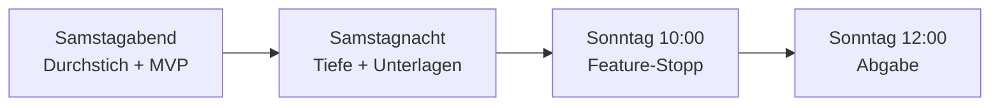

# 06 Roadmap bis Sonntag 12:00

Keine Stundenschätzungen. Vier Meilensteine, pro Meilenstein eine Checkliste mit Namen.
**MUSS** = BMW-Pflicht oder ohne das gibt es keine Demo. **KANN** = Bonus.
Ticket-Nummern (A5, C6, D3 ...) stehen in den Arbeitsbüchern in `docs/pfade/`. Wer ein Ticket fertig hat, setzt dort den Haken.

## Die vier BMW-Pflichten

| # | Pflicht | Stand |
|---|---|---|
| 1 | Prototyp: Daten → Anforderungen → Priorität → PM-Entscheidung | Backend läuft, Cockpit nur Liste |
| 2 | 15 bis 25 Anforderungen mit ID, Beschreibung, Befunden und Quellen, Score, Begründung, Evidenzstufe, Annahmen, Status | 8 Anforderungen aus Beispielbefunden |
| 3 | Workflow-Diagramm: KI allein vs. Mensch | `docs/04_techflow.md` (Bild kommt nach `visuals/`) |
| 4 | Audit Trail bis zum Original-Kundenzitat | Hash-Kette da, Ansicht fehlt |

---

## Meilenstein 1: Samstagabend (Durchstich + MVP)

Ziel: Der ganze Weg läuft mit **echten** BMW-Daten, und die Demo-Strecke ist klickbar.

**MUSS**
- [ ] **Aditya:** A2 Studie einlesen, A3 Absatz, A4 Push (echte `evidence.json` und `context.json`)
- [ ] **Aditya:** A5 Befunde v1, danach A6 mit KI (`signals.json`)
- [ ] **Dennis:** C3 Faktoren aus echten Daten
- [ ] **Piyush:** Pipeline G60-US läuft von Anfang bis Ende (L2, L3, L4)
- [ ] **Lasse:** D3 Detailseite (Wasserfall, Befunde, Zitate, Quellen, Annahmen)
- [ ] **Lasse:** D4 Entscheiden mit Pflicht-Begründung + Audit-Seite
- [ ] **Piyush:** Erste Abgabe auf ehl.gg (L8)
- [ ] **Alle:** Entscheidungskarten E01 bis E08 beantwortet

**KANN**
- [ ] **Aditya:** A7 Konflikte zwischen Befunden
- [ ] **Lasse:** D5 Gewichte-Regler
- [ ] **Dennis:** C4 Scope-Wächter prüfen

## Meilenstein 2: Samstagnacht (Tiefe + Unterlagen)

Ziel: 15 bis 25 Anforderungen, zweites Szenario, Pitch-Grundlagen. Zwei Schichten, immer mindestens zwei Personen wach.

**MUSS**
- [ ] **Dennis:** Anforderungsliste auf 15 bis 25 bringen, Texte schärfen (C8)
- [ ] **Piyush:** Cache füllen, App einmal komplett ohne Internet testen (`DEMO_MODUS=true`)
- [ ] **Piyush:** README und `docs/ARCHITEKTUR.md` prüfen, Deck v1
- [ ] **Aditya:** Eval-Zahl: Stichprobe labeln (A9), Skript und Report (A10)
- [ ] **Lasse:** Politur und Demo-Strecke dreimal klicken (D7, D8)

**KANN**
- [ ] **Piyush / Aditya:** Zweites Szenario G70-US und F70 (A8, B5)
- [ ] **Lasse:** D6 Trichter-Seite (`/overview`)
- [ ] **Dennis:** C9 Randfälle, C10 Was-wäre-wenn
- [ ] **Alle:** Missionen aus `missionen/` fertig und abgelegt

## Meilenstein 3: Sonntag 10:00 (Feature-Stopp)

Ab jetzt keine neuen Features. Nur Fehler, Texte, Demo, Folien.

**MUSS**
- [ ] **Piyush:** Frischer Klon läuft nach Anleitung (Skill `demo-check`)
- [ ] **Lasse:** Backup-Video der Demo (2 Minuten)
- [ ] **Piyush:** Deck final, Pitch-Text sitzt
- [ ] **Aditya, Dennis, Lasse:** je eine Folie oder ein Demo-Teil auswendig
- [ ] **Alle:** Pitch-Probe mit Stoppuhr, jede Person beantwortet zwei Jury-Fragen
- [ ] **Piyush:** Selbstreview (Skill `selbstreview`), Befunde abgearbeitet

**KANN**
- [ ] **Alle:** Zweite Probe mit Gegenfragen

## Meilenstein 4: Sonntag 12:00 (Abgabe)

**MUSS**
- [ ] **Piyush:** Letzter Push, CI grün, `entire status` zeigt "Enabled", Checkpoints vorhanden
- [ ] **Piyush:** Secret-Scan sauber (`python scripts/secret_scan.py`)
- [ ] **Piyush:** Abgabe auf ehl.gg, danach Link und Commit prüfen (Skill `abgabe`)
- [ ] **Alle:** Folien-PDF hochgeladen

**Achtung:** `docs/ZEITPLAN.md` und `CLAUDE.md` planen Code-Freeze **10:30** und Abgabe **11:30**, damit 30 Minuten Puffer bleiben. Diesen Puffer würde ich behalten. Der Feature-Stopp um 10:00 passt dazu.

## Wenn die Zeit knapp wird: was wir streichen (von oben nach unten)

1. Zweites Szenario nur als Screenshot
2. Gewichte-Regler: feste Gewichte, Formel auf der Folie
3. Trichter-Seite
4. Challenge mit KI: die regelbasierte Version bleibt

**Nie streichen:** Kette Zitat → Befund → Anforderung, PM-Entscheidung mit Begründung, Audit Trail, Evidenzstufe.
