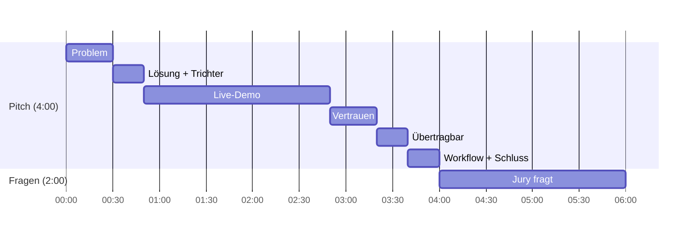

# 07 Pitch: 6 Minuten inklusive Fragen

Die ausführliche Fassung mit allen Jury-Fragen steht in `docs/pitch/PITCH.md` und `docs/pitch/JURY-FAQ.md`. Diese Seite ist die Kurzform zum Üben.

**Der Satz zum Auswendiglernen:**
> Wir sagen nicht nur, WAS der nächste 5er braucht, sondern WIE SICHER wir uns sind und WARUM. Der Produktmanager behält jede Entscheidung.

## Ablauf

| Zeit | Wer | Inhalt |
|---|---|---|
| 0:00 | Piyush | **Problem:** Heute lesen Menschen tausende Kommentare von Hand. Das ist langsam und schwer nachvollziehbar. |
| 0:30 | Piyush | **Lösung:** ein Satz + Trichter G60 USA: Kommentare → Befunde → Anforderungen |
| 0:50 | Lasse klickt, Piyush spricht | **Live-Demo** (Klickpfad unten) |
| 2:50 | Aditya | **Vertrauen:** die eine Zahl, Webquellen mit Vertrauensstufe |
| 3:20 | Aditya, Lasse schaltet um | **Übertragbar:** Szenario umschalten, eine Config-Datei |
| 3:40 | Piyush | **Workflow:** KI allein vs. Mensch (Bild aus `visuals/`), Schlusssatz |
| 4:00 | alle | **Fragen.** Dennis antwortet auf alles zu Priorität und Score. |

## Demo-Klickpfad

1. Liste G60-US: Rang, Score, Evidenzstufe, Konflikt-Badge.
2. Platz 1 öffnen: Wasserfall, Befunde, **Originalzitat** (z. B. `G60-0019`), Studienwert, Webquelle.
3. Konflikt zeigen: "Display gelobt" gegen "Touch-Bedienung kritisiert". Wir mitteln nicht weg.
4. **Challenge:** "Ist das nur eine Gewohnheitsfrage älterer Kunden?" Die KI antwortet mit Belegen **und** Gegenbelegen.
5. Kriterium **bearbeiten**, dann **freigeben** mit Begründung.
6. Regler "Zukunft" hoch: die Liste sortiert sich neu.
7. Audit Trail: alle Schritte, Badge "Kette gültig". CSV-Export.

Rückfall: `DEMO_MODUS=true` (Cache), dann Backup-Video, dann Screenshots (`demo/README.md`).

## Fünf Jury-Fragen, die jede Person beantworten können muss

| Frage | Antwort in zwei Sätzen |
|---|---|
| Woher weiß ich, dass die KI keine Zitate erfindet? | Die KI darf nur IDs nennen, die wir ihr gegeben haben, und ein Test prüft das. Erfundene IDs werden abgelehnt. |
| Warum rechnet nicht die KI die Priorität? | Weil der PM jeden Punkt nachvollziehen und ändern können muss. Die Formel ist gleich bei jedem Lauf. |
| Was ist der Unterschied zwischen Evidenzstufe und Score? | Die Stufe sagt, wie sicher wir sind. Der Score sagt, wie wichtig es ist. Schwach Belegtes rutscht nach unten, wird aber nicht versteckt. |
| Was, wenn Belege sich widersprechen? | Wir zeigen beide und markieren den Konflikt. Der PM wägt ab. |
| Wie kommt ein neues Modell dazu? | Eine JSON-Datei in `config/scenarios/`, dann Pipeline starten. |

## Übung

- [ ] Jede Person erklärt das Produkt in zwei Sätzen (ohne Spickzettel).
- [ ] Zweimal komplett mit Stoppuhr, vier Minuten Pitch.
- [ ] Jede Person beantwortet zwei Fragen aus `docs/pitch/JURY-FAQ.md`, die sie nicht selbst gewählt hat.
- [ ] Einmal mit ausgeschaltetem WLAN.
