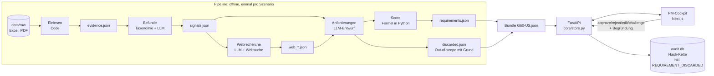

# Architektur

> Einfache Sprache: Jede Person im Team muss das der Jury erklären können.
> Bei jedem PR mit Code aktualisieren (Komponenten, Datenfluss, Entscheidungen).

## In zwei Sätzen

Eine **Pipeline** (Python) verdichtet BMW-Daten und Webquellen Stufe für Stufe zu priorisierten
Anforderungen und speichert jedes Zwischenergebnis als JSON. Ein **Backend** (FastAPI) stellt die
Ergebnisse bereit, nimmt PM-Entscheidungen an und schreibt jede Änderung in einen **Prüfpfad**
(SQLite, Hash-Kette); das **PM-Cockpit** (Next.js) zeigt alles an.

## Datenfluss



## Komponenten

| Komponente | Datei | Aufgabe | KI? |
|---|---|---|---|
| Datenmodell | `src/backend/core/models.py` | Vertrag: Evidence, Signal, Requirement, AuditEvent | – |
| Prüfpfad | `src/backend/core/audit.py` | append-only Ereignisse, SHA-256-Kette, `verify()` | – |
| Store | `src/backend/core/store.py` | Zustand pro Szenario, PM-Aktionen, Neuberechnung | – |
| LLM-Zugang | `src/backend/core/llm.py` | OpenAI Responses API, JSON-Schema, Cache, Demo-Modus | ja |
| Einlesen | `src/backend/evidence_internal/loaders.py` | Feedback + Studie → Belege | nein |
| Befunde | `src/backend/evidence_internal/signals.py` | Gruppieren (Taxonomie) + Zusammenfassen (LLM) | ja |
| Web | `src/backend/evidence_external/web_research.py` | 13 Fragen → Aussagen → Webbelege (1 URL = 1 Beleg) + Befunde `competitor_advantage`/`trend`, nur mit high/medium-Beleg | ja |
| Web-Fragen | `src/backend/evidence_external/questions.py` | 13 Fragen je Szenario: 8 Wettbewerb (Befund × Wettbewerber) + 5 Trend 2028-2031 | nein |
| Web-Vertrauen | `src/backend/evidence_external/trust.py` | high/medium/low allein aus der Domain | nein |
| Anforderungen | `src/backend/requirements_engine/derive.py` | Entwurf (LLM) + Faktoren (Code) | ja |
| Priorisierung | `src/backend/requirements_engine/scoring.py` | gewichtete Formel, Konfidenz je Evidenzstufe | nein |
| Evidenzstufe | `src/backend/requirements_engine/evidence_level.py` | Regeln A-D | nein |
| Challenge | `src/backend/requirements_engine/challenge.py` | Antwort mit Belegen + Gegenbelegen | ja (Ziel) |
| API | `src/backend/api/routes.py` | REST-Endpunkte, siehe `src/shared/API.md` | – |
| Szenarien | `config/scenarios/*.json` | Fahrzeug × Markt, Dateien, Wettbewerber | – |
| Werkbank | `src/frontend/app/studio/` | 5 Werkzeuge zum Prüfen der Liste: Duell, Konflikt-Arena, Annahmen-Schalter, Kundenstimmen, Entscheidungslauf | nein |
| Werkbank-Rechnung | `src/frontend/src/studio/scoring.ts` | Score ohne Annahmen, Gewichte aus Duellen (gleiche Formel wie `scoring.py`) | nein |
| Baukasten | `src/frontend/baukasten/*.json` | Texte, Farben, Feature-Schalter, angepinnte Zitate; Nicht-Coder ändern sie, `tests/test_baukasten.py` prüft sie | – |
| Shader-Hintergrund | `src/frontend/src/components/ShaderBackground.tsx` | Animierter WebGL-Verlauf hinter allen Cockpit-Seiten (fixed, `z-index` unter dem Inhalt) | nein |

## Entscheidungen (Was + Warum + Verworfen)

| Entscheidung | Warum | Verworfen |
|---|---|---|
| Score per Formel in Python, nicht per LLM | reproduzierbar, jeder Punkt erklärbar, PM kann Gewichte ändern | LLM vergibt Priorität (Blackbox, schwankt) |
| Triangulation per Regel (`evidence_external/triangulation.py`): nur Webbelege mit Vertrauen high/medium und stance=supports werden an den internen Befund gehängt; Widersprüche gehen als Gegenbeleg an die Challenge | zwei unabhängige Quellenarten heben die Evidenzstufe, Forum-Stimmen und Widerspruch dürfen das nicht verfälschen | Widerspruch ignorieren (PM sähe nur die schöne Seite), LLM entscheidet über Zuordnung (schwankt) |
| Evidenzstufe per Regel (A-D) | Brief verlangt klare Trennung Evidenz vs. Annahme | LLM-Selbsteinschätzung ("confidence: 0.8") |
| Vorgruppieren per BMW-Taxonomie, LLM nur zum Zusammenfassen | ~3.600 Kommentare → ~50 LLM-Aufrufe statt 3.600; erklärbar | Embedding-Clustering aller Kommentare (teurer, schwer erklärbar) |
| Pipeline-Stufen als JSON-Dateien | 4 Pfade parallel, jede Stufe einzeln prüfbar, Demo ohne Wartezeit | alles live pro Request (langsam, teuer) |
| Prüfpfad append-only mit Hash-Kette in SQLite | Manipulation erkennbar, eine Datei, kein Server | Log-Datei (nicht abfragbar), Blockchain (Overkill) |
| LLM-Ausgaben nur mit IDs aus der Eingabe, Test prüft das | Halluzinierte Belege wären fatal für Vertrauen | freie Texte ohne Quellen |
| BMW-Daten nie im Git | Repo ist öffentlich; Beispiele sind synthetisch | Daten committen |
| Kein Login im Prototyp: `actor` ist selbst angegeben | Login ist out of scope für 24 h; die Hash-Kette schützt den Verlauf, nicht die Identität. In Produktion: SSO und `actor` aus dem Token statt aus dem Request | Fake-Login (Scheinsicherheit) |
| CSV-Export entschärft Zellen, die mit `= + - @` beginnen | Texte stammen teils aus LLM/Web; Excel würde sie als Formel ausführen | ungeprüfter Export |
| Webfragen und Quellen-Vertrauen per Regel (Python), nicht per LLM | Fragen sind reproduzierbar und cache-treffend; Vertrauen entscheidet, ob ein Beleg in einen Befund darf, und muss erklärbar sein | LLM erfindet Fragen / bewertet Quellen (schwankt je Lauf) |
| Webbelege mit Vertrauen `low` bleiben sichtbar, kommen aber in keinen Befund; URLs mit `\`, `user@`, Leerzeichen oder Nicht-http-Schema gelten als `low` | Der PM soll sehen, was aussortiert wurde; Browser und `urlparse` lesen solche URLs verschieden (`evil.com\@caranddriver.com`), das ließe sich als Testmagazin tarnen | Low-Belege löschen / URLs nur mit `urlparse` prüfen |
| Prüfpfad mit Sperre (`threading.Lock`) um die SQLite-Verbindung | FastAPI beantwortet Anfragen parallel; ohne Sperre lasen Threads halbe Zeilen (Absturz) und zwei Einträge konnten denselben Vorgänger-Hash bekommen (Kette ungültig ohne Fälschung). Test: `test_parallel_requests_keep_chain_valid` | eine Verbindung pro Anfrage (mehr Umbau), WAL-Modus allein (löst die Hash-Reihenfolge nicht) |
| Duell-Modus leitet Gewichte aus Paarvergleichen ab, Übernahme nur mit Begründung über `PUT /weights` | PMs sagen sicherer "A ist wichtiger als B" als "Reichweite = 20 %"; die Übernahme steht im Prüfpfad | Gewichte direkt aus Duellen setzen, ohne Bestätigung (PM verliert Kontrolle) |
| Annahmen-Schalter rechnet im Browser und speichert nichts | Was-wäre-wenn soll den Prüfpfad nicht füllen; Formel identisch zum Backend, darum gleiche Zahlen | Backend-Endpunkt pro Schalter (unnötige Vertragsänderung) |
| Werkbank unter `/studio` als eigene Dateien, Baukasten als JSON | Das Cockpit (`/`, Detail, Audit) gehört Pfad D; neue Werkzeuge sollen keine Merge-Konflikte erzeugen. Texte und Farben als JSON, damit Nicht-Coder mitbauen | Werkzeuge in die Cockpit-Seiten einbauen (Konflikte mit Lasse), Texte im Code (nur für Coder änderbar) |
| Shader per rohem WebGL (eigener Vertex/Fragment-Shader), nicht per three.js | Kein neues Paket nötig (Browser-API reicht für einen einfachen Verlaufs-Shader), weniger Bundle-Gewicht | three.js/react-three-fiber (neue Abhängigkeit, Rückfrage nötig, Overkill für einen Verlauf) |
| Neues Fahrzeug/Markt = neue JSON in `config/scenarios/` | Brief: "adaptable to other BMW vehicles and markets" | Sonderlogik pro Modell |

## Externe Dienste

| Dienst | Wofür | Ohne Netz |
|---|---|---|
| OpenAI Responses API (`OPENAI_MODEL`) | Befunde zusammenfassen, Anforderungen formulieren, Challenge | Cache in `data/cache/` (lokal), geprüfte Webantworten in `data/demo_cache/` (im Repo), `DEMO_MODUS=true` |
| OpenAI Websuche-Tool | externe Belege mit URL | `data/demo_cache/` (Demo läuft ohne Netz) |

## Starten

```bash
python -m venv .venv && .venv/Scripts/activate      # Mac: source .venv/bin/activate
pip install -r requirements.txt
python src/backend/pipeline.py --scenario G60-US    # braucht data/raw/ + OPENAI_API_KEY
uvicorn main:app --app-dir src/backend --reload --port 8000   # ohne Pipeline: Beispieldaten
python -m pytest -q
```
