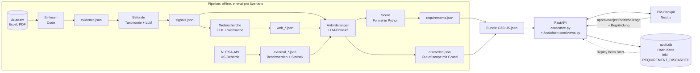

# Architektur

> Einfache Sprache: Jede Person im Team muss das der Jury erklären können.
> Bei jedem PR mit Code aktualisieren (Komponenten, Datenfluss, Entscheidungen).

## In zwei Sätzen

Eine **Pipeline** (Python) verdichtet BMW-Daten und Webquellen Stufe für Stufe zu priorisierten
Anforderungen und speichert jedes Zwischenergebnis als JSON. Ein **Backend** (FastAPI) stellt die
Ergebnisse bereit, nimmt PM-Entscheidungen an und schreibt jede Änderung in einen **Prüfpfad**
(SQLite, Hash-Kette); das **PM-Cockpit** (Next.js) zeigt alles an.

## Datenfluss



## Komponenten

| Komponente | Datei | Aufgabe | KI? |
|---|---|---|---|
| Datenmodell | `src/backend/core/models.py` | Vertrag: Evidence, Signal, Requirement, AuditEvent | – |
| Vertrag Welle 2 | `src/backend/core/model_parts.py` | Robustheit, Segment-Konflikt, Business, Datenabdeckung (alle Felder mit Default) | – |
| Datensatz-Profil | `config/datasets.json` + `core/datasets.py` | Spalten- und Blattnamen der BMW-Dateien; neuer Datensatz = JSON ändern, kein Code | – |
| Ansichten | `src/backend/core/views.py`, `portfolio.py`, `insights.py` | fertige Antworten pro Bildschirm: Übersicht, Score-Wasserfall, Was-wäre-wenn, Portfolio-Matrix, Markt-Vergleich, Chancen-Karte, Trendradar, „Was wir nicht wissen“ | nein |
| Replay | `src/backend/core/replay.py` | spielt PM-Entscheidungen und Gewichte beim Start aus `audit.db` neu ab | nein |
| NHTSA | `src/backend/evidence_external/nhtsa.py` | US-Behördenbeschwerden als zweite Kundenquelle + Wettbewerbs-Statistik, Cache in `data/external_cache/` | nein |
| EPA-Reichweite | `src/backend/evidence_external/fueleconomy.py` | amtliche Reichweite und Verbrauch von BMW und Wettbewerbern (nur US), ein Beleg je Fahrzeug, Cache in `data/external_cache/fueleconomy/` | nein |
| Prüfpfad | `src/backend/core/audit.py` | append-only Ereignisse, SHA-256-Kette, `verify()` | – |
| Store | `src/backend/core/store.py` | Zustand pro Szenario, PM-Aktionen, Neuberechnung | – |
| LLM-Zugang | `src/backend/core/llm.py` | OpenAI Responses API, JSON-Schema, Cache, Demo-Modus | ja |
| Einlesen | `src/backend/evidence_internal/loaders.py` | Feedback + Studie → Belege | nein |
| Befunde | `src/backend/evidence_internal/signals.py` | Gruppieren (Taxonomie) + Zusammenfassen (LLM) | ja |
| Web | `src/backend/evidence_external/web_research.py` | 13 Fragen → Aussagen → Webbelege (1 URL = 1 Beleg) + Befunde `competitor_advantage`/`trend`, nur mit high/medium-Beleg | ja |
| Web-Fragen | `src/backend/evidence_external/questions.py` | bis 8 Wettbewerb (Befund × Wettbewerber) + 5 Trend + bis 3 Markt-Trends aus der Config; Zeitfenster = Nachfolger-Jahr −2 bis +1 | nein |
| Web-Vertrauen | `src/backend/evidence_external/trust.py` | high/medium/low allein aus der Domain | nein |
| Anforderungen | `src/backend/requirements_engine/derive.py` | Entwurf (LLM) + Faktoren (Code) | ja |
| Priorisierung | `src/backend/requirements_engine/scoring.py` | gewichtete Formel, Konfidenz je Evidenzstufe | nein |
| Evidenzstufe | `src/backend/requirements_engine/evidence_level.py` | Regeln A-D | nein |
| Challenge | `src/backend/requirements_engine/challenge.py` | Antwort mit Belegen + Gegenbelegen | ja (Ziel) |
| API | `src/backend/api/routes.py`, `api/views.py` | REST-Endpunkte (Schreiben + Ansichten), siehe `src/shared/API.md` | – |
| Prompt-Linse | `src/backend/core/lens.py` | PM-Frage → Gewichte + Kategorien + „nur Lücken“ (LLM, sonst Schlüsselwort-Regeln) → Top 5 in Python | ja (nur Gewichte) |
| Entscheidungshilfen | `src/backend/core/req_insights.py` | Matrix Heute/Zukunft × Evidenz, Markt-Gegenstück (Jaccard), Entscheidungs-Memo (Markdown) | nein |
| API Linse/Memo | `src/backend/api/insights_routes.py` | `/lens`, `/matrix`, `/counterparts`, `/memo` | – |
| Szenarien | `config/scenarios/*.json` | Fahrzeug × Markt, Dateien, Wettbewerber | – |
| Shader-Hintergrund | `src/frontend/src/components/ShaderBackground.tsx` | Animierter WebGL-Verlauf hinter allen Cockpit-Seiten (fixed, `z-index` unter dem Inhalt) | nein |
| Übersicht | `src/frontend/app/overview/page.tsx`, `src/components/OverviewPageClient.tsx` | Trichter Belege → Befunde → Anforderungen → freigegeben, Top-3-Vorschläge, Evidenzverteilung, Workflow-Schritte | nein |
| Audit-Seite | `src/frontend/app/audit/page.tsx`, `src/components/AuditPageClient.tsx`, `AuditTrail.tsx` | zeigt Kettenprüfung (`verify()`) und Zeitstrahl aller Ereignisse, filterbar nach Szenario/Anforderung | nein |
| PM-Entscheidung | `src/frontend/src/components/DecisionPanel.tsx` | Freigeben/Ablehnen/Bearbeiten/Challenge direkt auf der Detailseite, Begründungspflicht, zeigt KI-Antwort mit Beleg-IDs | ja (Challenge-Antwort) |


## Entscheidungen (Was + Warum + Verworfen)

| Entscheidung | Warum | Verworfen |
|---|---|---|
| Score per Formel in Python, nicht per LLM | reproduzierbar, jeder Punkt erklärbar, PM kann Gewichte ändern | LLM vergibt Priorität (Blackbox, schwankt) |
| Triangulation per Regel (`evidence_external/triangulation.py`): nur Webbelege mit Vertrauen high/medium und stance=supports werden an den internen Befund gehängt; Widersprüche gehen als Gegenbeleg an die Challenge | zwei unabhängige Quellenarten heben die Evidenzstufe, Forum-Stimmen und Widerspruch dürfen das nicht verfälschen | Widerspruch ignorieren (PM sähe nur die schöne Seite), LLM entscheidet über Zuordnung (schwankt) |
| Evidenzstufe per Regel (A-D) | Brief verlangt klare Trennung Evidenz vs. Annahme | LLM-Selbsteinschätzung ("confidence: 0.8") |
| Vorgruppieren per BMW-Taxonomie, LLM nur zum Zusammenfassen | ~3.600 Kommentare → ~50 LLM-Aufrufe statt 3.600; erklärbar | Embedding-Clustering aller Kommentare (teurer, schwer erklärbar) |
| Pipeline-Stufen als JSON-Dateien | 4 Pfade parallel, jede Stufe einzeln prüfbar, Demo ohne Wartezeit | alles live pro Request (langsam, teuer) |
| Prüfpfad append-only mit Hash-Kette in SQLite | Manipulation erkennbar, eine Datei, kein Server | Log-Datei (nicht abfragbar), Blockchain (Overkill) |
| LLM-Ausgaben nur mit IDs aus der Eingabe, Test prüft das | Halluzinierte Belege wären fatal für Vertrauen | freie Texte ohne Quellen |
| BMW-Rohdaten liegen in `data/raw/` im Repo (bewusste Entscheidung des Leads, 10.10.); Pipeline-Ergebnisse, LLM-Cache und `audit.db` bleiben lokal | Das Team braucht alle Quellen an einem Ort, und die Jury kann die Pipeline nachlaufen lassen. Tests nutzen trotzdem nur synthetische Mini-Daten | Verteilung per USB (fehleranfällig, Jury könnte nichts nachprüfen) |
| Ansichten als fertige Endpunkte („View-Models“), Frontend rechnet nichts | CSV, UI und Pitch zeigen dieselben Zahlen; Logik ist ohne Browser testbar (`tests/test_views.py`) | Rechnen im Frontend (zweite Formel, kann abweichen) |
| Was-wäre-wenn (`POST /whatif`) speichert nichts; erst `PUT /weights` schreibt den Prüfpfad | Probieren soll den Prüfpfad nicht füllen; Übernahme braucht eine Begründung | jede Reglerbewegung protokollieren (Prüfpfad unlesbar) |
| PM-Entscheidungen per Replay aus `audit.db` statt eigener Status-Datei | eine einzige Wahrheit; nach Neustart zeigen UI und Prüfpfad dasselbe | Status zusätzlich in JSON (zweite Quelle, kann abweichen) |
| EPA-Reichweite je Fahrzeug nur als Beleg (`external_stat`), ohne eigenen Befund; Fahrzeug ohne EPA-Reichweite (z. B. Audi A6 e-tron, nicht in der EPA-Liste) bekommt keinen Beleg | Prüfstandswerte vergleichen Hersteller fair, ersetzen aber keine Kundenstimme; fehlender Wert darf nicht geschätzt werden | Radgröße je Fahrzeug fest in der Config, Alltagsverbrauch weicht ab |
| NHTSA-Beschwerden bekommen eigene Befunde, werden nicht an interne Befunde gleicher Kategorie gehängt | eine Bremsen-Beschwerde darf „Touch-Bedienung“ nicht stützen und die Evidenzstufe nicht unehrlich heben | grobe Zuordnung per Kategorie |
| Pipeline `--scenario all`: Fehler stoppt nur das betroffene Szenario, Zusammenfassung am Ende; Webfragen einzeln abgefangen | Nachtlauf über 6 Szenarien darf nicht an einem Timeout scheitern; nichts wird still verschluckt | bei Fehler weiterrechnen (spätere Stufen fielen auf Beispieldaten zurück) |
| Kein Login im Prototyp: `actor` ist selbst angegeben | Login ist out of scope für 24 h; die Hash-Kette schützt den Verlauf, nicht die Identität. In Produktion: SSO und `actor` aus dem Token statt aus dem Request | Fake-Login (Scheinsicherheit) |
| CSV-Export entschärft Zellen, die mit `= + - @` beginnen | Texte stammen teils aus LLM/Web; Excel würde sie als Formel ausführen | ungeprüfter Export |
| Webfragen und Quellen-Vertrauen per Regel (Python), nicht per LLM | Fragen sind reproduzierbar und cache-treffend; Vertrauen entscheidet, ob ein Beleg in einen Befund darf, und muss erklärbar sein | LLM erfindet Fragen / bewertet Quellen (schwankt je Lauf) |
| Webbelege mit Vertrauen `low` bleiben sichtbar, kommen aber in keinen Befund; URLs mit `\`, `user@`, Leerzeichen oder Nicht-http-Schema gelten als `low` | Der PM soll sehen, was aussortiert wurde; Browser und `urlparse` lesen solche URLs verschieden (`evil.com\@caranddriver.com`), das ließe sich als Testmagazin tarnen | Low-Belege löschen / URLs nur mit `urlparse` prüfen |
| Prüfpfad mit Sperre (`threading.Lock`) um die SQLite-Verbindung | FastAPI beantwortet Anfragen parallel; ohne Sperre lasen Threads halbe Zeilen (Absturz) und zwei Einträge konnten denselben Vorgänger-Hash bekommen (Kette ungültig ohne Fälschung). Test: `test_parallel_requests_keep_chain_valid` | eine Verbindung pro Anfrage (mehr Umbau), WAL-Modus allein (löst die Hash-Reihenfolge nicht) |
| Shader per rohem WebGL (eigener Vertex/Fragment-Shader), nicht per three.js | Kein neues Paket nötig (Browser-API reicht für einen einfachen Verlaufs-Shader), weniger Bundle-Gewicht | three.js/react-three-fiber (neue Abhängigkeit, Rückfrage nötig, Overkill für einen Verlauf) |
| Prompt-Linse: LLM wählt nur Gewichte und Kategorien, nie IDs; Python rechnet die Top 5 auf Kopien; Übernehmen erst per `PUT /weights` | Kein Treffer und keine Quelle kann erfunden werden, Rang bleibt nachrechenbar, PM behält Kontrolle (Audit `AI_LENS_SUGGESTED` + `WEIGHTS_CHANGED`). Das LLM sieht keine BMW-Daten, darum darf der Demo-Cache ins Repo | LLM sortiert Anforderungen selbst (nicht reproduzierbar, IDs halluzinierbar); Linse ändert Gewichte sofort (PM verliert Kontrolle) |
| Markt-Gegenstück per Kategorie + Titel-Jaccard ≥ 0,3, Memo in Python statt LLM | PM kann die Regel nachrechnen; jede Zahl im Memo stammt aus Store und `audit.verify()` | Embeddings (neue Abhängigkeit, nicht erklärbar), LLM-Memo (könnte Zahlen erfinden) |
| Neues Fahrzeug/Markt = neue JSON in `config/scenarios/` | Brief: "adaptable to other BMW vehicles and markets" | Sonderlogik pro Modell |
| Neue Cockpit-Seiten (Übersicht, Audit, Entscheidung) vom Lead übernommen, aber auf die lokalen Design-Tokens (`--background/--foreground/--surface/--accent/--table-background/--score-slider` in `globals.css`, Dark-Mode über `.dark`-Klasse, `ThemeToggle`) umgestellt statt der mitgelieferten festen Slate/Blau-Farben | Ein Farbsystem für die ganze App, Dark-Mode funktioniert auch auf den neuen Seiten, BMW-Blau bleibt einzige Akzentfarbe | Piyushs Farben unverändert lassen (zwei Stile nebeneinander, kein Dark-Mode auf den neuen Seiten) |

## Externe Dienste

| Dienst | Wofür | Ohne Netz |
|---|---|---|
| OpenAI Responses API (`OPENAI_MODEL`) | Befunde zusammenfassen, Anforderungen formulieren, Challenge | Cache in `data/cache/` (lokal), geprüfte Webantworten in `data/demo_cache/` (im Repo), `DEMO_MODUS=true` |
| OpenAI Websuche-Tool | externe Belege mit URL | `data/demo_cache/` (Demo läuft ohne Netz) |
| NHTSA Complaints API (`api.nhtsa.gov`, ohne Key, gemeinfrei) | US-Kundenbeschwerden BMW + Wettbewerber | `data/external_cache/nhtsa/` (im Repo) |
| fueleconomy.gov Web Services (`fueleconomy.gov/ws/rest`, ohne Key, EPA) | EPA-Reichweite der Wettbewerber (Prüfstandswert, Ausstattung aus Config) | `data/external_cache/fueleconomy/` (im Repo) |

## Starten

```bash
python -m venv .venv && .venv/Scripts/activate      # Mac: source .venv/bin/activate
pip install -r requirements.txt
python src/backend/pipeline.py --scenario G60-US    # braucht data/raw/ + OPENAI_API_KEY
python src/backend/pipeline.py --scenario all       # alle 6 Szenarien, Zusammenfassung am Ende
uvicorn main:app --app-dir src/backend --reload --port 8000   # ohne Pipeline: Beispieldaten
python -m pytest -q
```
