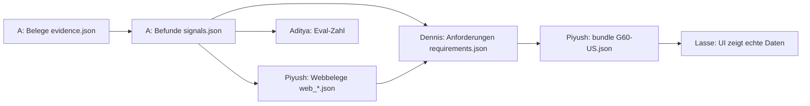

# Roadmap: 4 Personen, Claude baut, wir steuern (Sa 15:15 → So 11:30)

> **Für wen:** Piyush, Aditya, Dennis, Lasse. Fabian ist nicht dabei; seine Aufgaben (Pitch, Design, Video) sind verteilt.
> **Grundidee:** Niemand von uns muss programmieren können. **Claude programmiert, wir entscheiden, prüfen und erklären.**
> Jede Person hat ein **Arbeitsbuch** mit fertigen Tickets: Prompt kopieren → Claude baut mit Test → Fertig-Kriterium prüfen → Claude pusht.
> Stundenplan: [`ZEITPLAN.md`](ZEITPLAN.md) · Idee und Begründung: [`PLAN.md`](PLAN.md) · Brief: [`CHALLENGE.md`](CHALLENGE.md)

## 1. Wer macht was

| Person | Arbeitsbuch | Schreibt in (sonst nirgends) | Liefert | Spricht im Pitch |
|---|---|---|---|---|
| **Piyush** (Lead) | [`pfade/LEAD.md`](pfade/LEAD.md) + [`pfade/PFAD-B.md`](pfade/PFAD-B.md) (Web) | `core/`, `api/`, `main.py`, `pipeline.py`, `evidence_external/`, `tests/pfad_b/`, `src/shared/`, `config/`, `docs/`, Root | Integration, Webbelege, README, **Deck**, Abgabe | Problem, Lösung, Demo-Sprecher, Schluss |
| **Aditya** (Pfad A) | [`pfade/PFAD-A.md`](pfade/PFAD-A.md) | `evidence_internal/`, `tests/pfad_a/`, `tests/eval/` | Belege, Befunde, Konflikte, **Eval-Zahl** | Vertrauen (die Zahl) + Übertragbarkeit |
| **Dennis** (Pfad C) | [`pfade/PFAD-C.md`](pfade/PFAD-C.md) | `requirements_engine/`, `tests/pfad_c/` | Anforderungen, Score, Evidenzstufe, Optionsliste, Challenge-KI, **BMW-Mentor-Fragen** | Priorisierung + Jury-Fragen dazu |
| **Lasse** (Pfad D) | [`pfade/PFAD-D.md`](pfade/PFAD-D.md) | `src/frontend/` | PM-Cockpit, Design, **Backup-Video** | klickt die Demo |

Warum so: Aditya hat Daten/Tests als Profil, Dennis Anforderungen/Partner-Kontakt, Lasse Frontend. Die Webrecherche (früher Pfad B)
übernimmt Piyush, weil das Rückgrat schon steht und der Lead bis 18:00 sonst nur wartet. Die Eval-Zahl übernimmt Aditya,
weil sie auf seinen Daten beruht. Verworfen: Web bei Dennis (Pfad C ist schon der längste Pfad).

## 2. Wie die Teile zusammenhängen (wer wartet auf wen)

**Niemand wartet wirklich:** Bis die echte Datei da ist, nimmt jede Stufe automatisch das Beispiel aus `src/shared/beispiele/stufen/`
(`pipeline.py` macht das). Lasse baut gegen das Backend mit Beispiel-Bundle. Echte Daten fließen ab den Sync-Punkten ein.

## 3. Meilensteine und Sync-Punkte (hart: wackelt einer, wird gekürzt, nicht verlängert)

| Zeit | Name | Prüfbar, wenn … | Wer prüft |
|---|---|---|---|
| **Sa 15:45** | M0 Setup | alle 4: `python -m pytest -q` grün, `entire status` = Enabled, `.env` mit eigenem Key, `data/raw/` gefüllt | jede Person selbst, Piyush fragt reihum |
| **Sa 17:30** | M1 Echte Belege | `python src/backend/pipeline.py --scenario G60-US --stage evidence` schreibt ~3.600 Feedback- + Studienbelege; UI-Liste zeigt Beispieldaten | Piyush |
| **Sa 18:30** | **M2 Durchstich** | `pipeline.py --scenario G60-US` (alle Stufen) läuft durch; Backend neu starten; UI zeigt **echte** Anforderungen mit Detailseite | alle 4 schauen 5 min zusammen auf Lasses Bildschirm |
| Sa 19:00 | Stand-up beim Essen | je 1 min: fertig / blockiert / nächstes Ticket; Kürzungsliste prüfen | Piyush |
| **Sa 22:00** | **M3 MVP + 1. Abgabe** | Befunde per LLM, Konflikte, Webbelege, Challenge-KI, Entscheiden + Prüfpfad + Regler im UI; CI grün; **Submit auf ehl.gg** | Piyush (Skill `abgabe`) |
| Sa 23:30 | Schicht 1 schläft | letzter Push von Dennis und Lasse, CI grün | jede Person |
| So 03:30 | Schicht 2 schläft | letzter Push von Piyush und Aditya, CI grün | jede Person |
| **So 07:30** | M4 Alles da | 2 Szenarien (G60-US, F70-EU) laufen; Eval-Zahl in `tests/eval/REPORT.md`; Deck v1 | Piyush |
| **So 08:00** | **Feature-Freeze** | ab jetzt nur Bugs, Texte, Demo, Deck | alle |
| **So 10:00** | Pitch-Probe | 2 Durchläufe mit Stoppuhr (Skill `pitch-prep`) | alle |
| **So 10:30** | **Code-Freeze** | nur noch Fixes aus `docs/ABGABE.md`, nur Piyush pusht | Piyush |
| **So 11:30** | **Abgegeben** | Submit/Update auf ehl.gg mit Deck (PDF) | Piyush |

**Schlafschichten:** Schicht 1 (Dennis, Lasse) schläft 23:30-03:30. Schicht 2 (Piyush, Aditya) schläft 03:30-07:30.
So sind immer 2 Personen wach, und in jeder Schicht sind Backend **und** Daten oder Frontend vertreten.

## 4. Die Arbeitsschleife (jedes Ticket, jede Person, immer gleich)

1. **Start der Sitzung:** In Claude Code schreiben: `Ich bin <Name>, starte meine Sitzung.` (Skill `sitzung-start`: holt main, prüft Setup, nennt dein nächstes Ticket.)
2. **Ticket nehmen:** das oberste offene `[ ]`-Ticket in deinem Arbeitsbuch. Zeitbox merken (Handy-Timer!).
3. **Prompt kopieren** und **einen eigenen Satz ergänzen** (z. B. was dir an den Daten aufgefallen ist). Warum: Der EHL-Reviewer bewertet unsere Prompts (35 % Ownership-Sprache), und ein Prompt kann zufällig der bewertete sein.
4. **Claude arbeitet:** erst Test, dann Code. Du liest nur die Zusammenfassung. Bei Rückfragen von Claude: kurz antworten, im Zweifel „nimm den einfacheren Weg“.
5. **Prüfen:** Schreib `Zeig mir für jeden Fertig-Punkt den Beweis (Befehl + Ausgabe).` Erst wenn alle Punkte belegt sind, ist das Ticket fertig.
6. **Speichern:** `sync` sagen. Claude committet (Ownership-Sprache), holt main, testet, pusht direkt auf main.
7. **Haken setzen:** im eigenen Arbeitsbuch `[ ]` → `[x]` (Claude macht das mit, im selben Commit).
8. **Zeitbox um und nicht fertig?** Abschnitt „Wenn es hakt“ des Tickets. Nach **45 min ohne Fortschritt: Piyush holen.** Lieber die Kürzung nehmen als festhängen.

**Wann `/clear`?** Wenn Claude im Kreis läuft (3× derselbe Fehler) oder nach jedem fertigen Ticket. Dann neu mit `Ich bin <Name>, starte meine Sitzung.`

## 5. Subagents: so arbeitet Claude parallel (spart pro Person 1-2 Stunden)

Claude kann Helfer („Subagents“) starten, die gleichzeitig arbeiten. Das lohnt sich, **wenn die Teile in verschiedenen Dateien liegen**.

| Wofür | So sagst du es Claude (anpassen) |
|---|---|
| **Zwei Dateien gleichzeitig** | „Nutze zwei Subagents parallel: einer baut `<datei1>`, einer `<datei2>`, beide nach dem Vertrag im Dateikopf. Danach prüfst du beides zusammen mit pytest.“ |
| **Tests parallel zum Code** | „Ein Subagent schreibt die Tests in `tests/pfad_x/test_<thema>.py` aus dem Fertig-Kriterium, während du den Code baust. Danach muss alles grün sein.“ |
| **Review vor dem Push** | „Bevor du sync machst: Lass den Subagent `superpowers:code-reviewer` den Diff prüfen. Behebe nur echte Fehler, keine Geschmacksfragen.“ |
| **Nachschauen, ohne zu ändern** | „Nutze den Explore-Subagent und finde heraus, wie `<funktion>` in `api/routes.py` benutzt wird. Nur lesen.“ |
| **Frontend-Seiten** (Lasse) | „Baue die Seite `/audit` mit einem Subagent, während du am Entscheidungs-Panel arbeitest. Gemeinsame Typen nur in `src/lib/api.ts`, die änderst nur du.“ |

**Regeln für Subagents (Claude hält sich daran, du achtest drauf):**
- Nur im eigenen Ordner schreiben. **Ein Subagent pro Datei**, nie zwei an derselben Datei.
- Subagents **committen und pushen nie.** Das macht die Hauptsitzung (sonst fehlen Entire-Checkpoints).
- Höchstens **3 gleichzeitig**. Jeder bekommt Dateipfad, Vertrag und Fertig-Kriterium mit (er startet ohne Vorwissen).
- Ergebnis wird in der Hauptsitzung mit Tests geprüft, bevor es gepusht wird.

## 6. Feste Entscheidungen (nicht neu diskutieren, Zeit sparen)

| Entscheidung | Warum | Verworfen |
|---|---|---|
| **Produkttexte und UI auf Englisch**, Code-Kommentare und Doku auf Deutsch | Brief, BMW-Daten und Zitate sind Englisch; Zitate bleiben im Original, keine Übersetzungsfehler zwischen Zitat und Befund | UI auf Deutsch (Zitate wären gemischtsprachig) |
| **Demo-Fall G60-US**, Übertragbarkeit mit **F70-EU** | meiste Kommentare (3.610), US-Studie mit Verteilung; F70-EU nutzt das andere Studienformat (Mittelwerte) und beweist damit die Config-Idee | G70-US als 2. Fall (gleicher Markt, beweist weniger) |
| **LLM nur über `core/llm.py`**, Modell `gpt-5-mini` | Cache + `DEMO_MODUS`: nach dem ersten Lauf geht die Demo offline | jeder Pfad mit eigenem Client |
| **Vorgruppieren per BMW-Taxonomie, LLM nur zum Formulieren** | billig, erklärbar, wenige LLM-Aufrufe | alles per LLM clustern (teuer, nicht reproduzierbar) |
| **Score per Formel in Python**, LLM vergibt keine Punkte | PM muss jeden Punkt nachvollziehen; reproduzierbar | LLM-Ranking |
| **Challenge-Fragen in der Demo als Vorschlags-Buttons** | gleicher Text = Cache-Treffer = Demo läuft ohne Netz | freies Eintippen live (Cache-Fehlschlag) |
| **Keine neuen Python-Pakete**; Frontend nur `next`, `react`, `tailwind` (+ was `create-next-app` mitbringt) | weniger Setup-Fehler auf 4 Laptops | UI-Bibliotheken, Chart-Bibliotheken (Balken per CSS reichen) |
| **Kein BMW-Logo, keine BMW-Markenoptik kopieren** | wir bauen ein Werkzeug, keine BMW-Seite; ruhiges Navy/Weiß reicht | BMW-CI nachbauen |
| **Keine echten BMW-Zitate in Tests, README, REPORT oder Deck-Dateien im Repo** | Repo ist öffentlich | Screenshots mit echten Zitaten im Repo (nur im Deck-PDF für die Jury, nicht im Git) |

## 7. Demo-Drehbuch (Ziel, auf das alle hinbauen)

Pitch = 6 min **inklusive** Fragen → 4:00 Pitch + 2:00 Fragen. Details und Jury-Antworten: [`pitch/PITCH.md`](pitch/PITCH.md).

| Zeit | Bild | Was gesagt wird | Braucht (Ticket) |
|---|---|---|---|
| 0:00 | Folie Problem | „Tausende Stimmen, ein Auto. Heute: Wochen Handarbeit, kaum nachvollziehbar.“ | Deck (L) |
| 0:30 | `/overview` Trichter | „3.610 Kundenstimmen → N Befunde → M Anforderungen.“ | D6, A5 |
| 0:50 | Liste `/` | Rang, Score-Balken, **Evidenzstufe A-D**, Konflikt-Badge | D2, C3 |
| 1:10 | Detail Platz 1 | Wasserfall: warum Platz 1; Belege vs. **Annahmen** getrennt; Originalzitate; Studienwert; Webquelle mit Vertrauensstufe; „Gibt es schon als Option“ | D3, A6, B3, C5 |
| 1:50 | Konflikt-Badge | „Widersprüche zeigen wir, statt sie wegzumitteln.“ | A7 |
| 2:05 | **Hinterfragen** (Vorschlags-Button) | KI antwortet mit Belegen **und** Gegenbelegen | C6, D4 |
| 2:30 | **Freigeben** mit Begründung | Status ändert sich, Eintrag im Prüfpfad | D4 |
| 2:45 | Regler „Zukunft“ hoch | Liste rankt live um, Pfeile zeigen Rangänderung | D5 |
| 3:00 | `/audit` | wer/was/wann/warum, „Kette gültig ✓“, CSV-Export | D4 |
| 3:15 | Szenario-Umschalter F70-EU | „Neues Modell = eine JSON-Datei.“ | A8, D2 |
| 3:30 | Folie Vertrauen | **die Zahl** (Grounding-Rate, Befund-Treue) | A10 |
| 3:45 | Folie Workflow KI vs. Mensch | Schluss-Satz | Deck (L) |

## 8. Kürzungsliste (von oben streichen, wenn ein Meilenstein wackelt)

1. Zweites Szenario F70-EU live → nur Folie „so einfach geht's“ (Config-Datei zeigen)
2. Triangulation Web ↔ intern (B4) → Webbelege nur als eigene Befunde
3. Optionslisten-Abgleich (C5) → Status „unknown“, Folie erklärt die Idee
4. LLM-Challenge (C6) → regelbasierte Startversion (existiert schon)
5. Befunde v2 per LLM (A6) → v1-Titel aus der Taxonomie
6. Gewichte-Regler (D5) → feste Gewichte, Formel auf der Folie
7. Trichter-Seite (D6) → Trichter als Folie

**Nie streichen:** Beleg → Befund → Anforderung mit Zitaten · Evidenzstufe · PM-Entscheidung · Prüfpfad · lauffähige Demo.

## 9. Wenn etwas schiefgeht

| Problem | Sofort tun |
|---|---|
| Tests auf main rot nach `git pull` | Nicht pushen. `python -m pytest -q` zeigt die Datei → Besitzer (Tabelle oben) im Chat anpingen. Nie fremden Code reparieren. |
| Merge-Konflikt | Claude zeigt beide Versionen, nichts wegwerfen. Fremde Datei → Piyush holen. |
| OpenAI-Fehler 429 / Key leer | Key in `.env` prüfen; 1 min warten; Claude soll kleinere Anfragen bauen. Notfall: Piyush lässt die Stufe mit seinem Key laufen, der Cache in `data/cache/` wird per USB geteilt. |
| Claude läuft im Kreis | `/clear`, Sitzung neu starten, Ticket-Prompt erneut, Zusatz: „Nimm den einfachsten Weg, der das Fertig-Kriterium erfüllt.“ |
| Backend zeigt alte Daten | Backend neu starten (es lädt `data/processed/*.json` nur beim Start). |
| Laptop tot / Akku leer | Arbeit ist auf main (wir pushen alle 30-45 min). Anderer Laptop: klonen, `docs/SETUP.md`. |
| Netz im Saal weg | `DEMO_MODUS=true` in `.env`, Backend neu starten; notfalls Backup-Video (Lasse). |

## 10. Definition „fertig“ (für jedes Ticket)

Ein Ticket ist fertig, wenn **(1)** alle Fertig-Punkte mit Befehl + Ausgabe belegt sind, **(2)** `ruff check src/backend tests` und
`python -m pytest -q` grün sind (Frontend: `npm run lint && npm run build`), **(3)** nur Dateien im eigenen Ordner geändert wurden,
**(4)** der Commit Was + Warum + Verworfen + Geprüft enthält und **(5)** gepusht ist.
