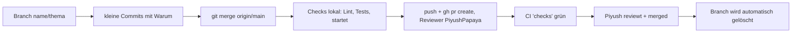

# Zusammenarbeit: 5 Leute, 5 Claude-Sessions, 0 Konflikte

Die Kurzform steht in [CLAUDE.md](../CLAUDE.md). Hier die ausführliche Version mit Begründungen.

## 1. Wer macht was (Ownership)

| Person | GitHub | Rolle | Schreibt in | Liest überall |
|---|---|---|---|---|
| **Piyush** | @PiyushPapaya | Lead, Captain, Backend, API-Vertrag, **einziger, der merged** | `src/backend/`, `src/shared/`, Root-Dateien, `.github/`, `.claude/`, `scripts/`, `README.md`, `CLAUDE.md`, `docs/ARCHITEKTUR.md` | ✅ |
| **Lasse** | @JoleEight | Frontend-Seiten mit Claude Code | `src/frontend/` | ✅ |
| **Aditya** | @AdiAvocado | Daten, Testfälle, Evaluation, Demo-Daten, Backup-Video | `tests/`, `demo/` | ✅ |
| **Dennis** | @Di0n-0 | Partner-Kontakt & Anforderungen, Research, README-Texte (Entwurf) | `docs/research/`, `docs/wissen/` | ✅ |
| **Fabian** | (folgt) | Pitch & Story, Slides, Design, Demo-Video-Schnitt | `docs/pitch/`, `design/` | ✅ |
| **alle** | | eigener Steckbrief und eigener Arbeitsbereich | `team/<name>.md`, `werkstatt/<name>/` | ✅ |

**Warum so streng?** Zwei Claude-Sessions, die dieselbe Datei ändern, erzeugen Merge-Konflikte. Die kosten Nicht-Codern leicht eine Stunde. Wenn jede Person nur in eigenen Ordnern schreibt, gibt es fast keine Konflikte.

**Brauche ich etwas in einem fremden Ordner?** Nicht selbst ändern. Stattdessen:
1. Issue anlegen (Vorlage „Aufgabe“) mit Owner und Deadline, oder
2. im eigenen PR kommentieren: „@JoleEight, ich brauche auf der Startseite einen Upload-Button“.

### Geteilte Dateien: nur Piyush

`README.md`, `CLAUDE.md`, `requirements.txt`, `src/frontend/package.json` und Lockfiles (Lasse beantragt, Piyush entscheidet), `.github/`, `.claude/settings.json`, `.gitignore`, `.gitattributes`, `.env.example`, `src/shared/`.

Für die README liefern Dennis (Texte) und Fabian (Bilder) ihre Entwürfe in `werkstatt/<name>/`; Piyush übernimmt sie.

## 2. Session-Start (macht Claude automatisch, Skill `sitzung-start`)

1. Name abfragen, `team/<name>.md` lesen.
2. `git switch main && git pull`: neuester Stand.
3. Neuen Branch: `git switch -c <name>/<kurzes-thema>` (z. B. `lasse/upload-seite`).
4. `docs/ARCHITEKTUR.md` lesen: Was gibt es schon?
5. `entire status`: Zeichnet Entire auf?
6. Der Person ihre nächsten Aufgaben zeigen (aus `team/<name>.md`, offenen Issues, `docs/ZEITPLAN.md`).

## 3. Arbeitsregeln

1. **Nur im eigenen Ordner und eigenen Workspace schreiben.** Fremde Ordner und `src/shared/` nur lesen.
2. **Verträge zuerst:** Piyush legt bis Sa 14:00 `src/shared/API.md` + Beispiel-JSONs fest. Frontend baut gegen diese Mocks, Backend liefert genau dieses Format. Änderungen am Vertrag nur per PR von Piyush, mit Ansage im Team.
3. **Neue Dependencies:** im PR beantragen („Neue Dependency: X, weil …; Alternative Y verworfen, weil …“). Nicht selbst installieren und committen.
4. **Kleine PRs, mindestens alle 1-2 Stunden.** Vor jedem PR: `git fetch origin && git merge origin/main`. Konflikte zeigen, erklären, **fragen**, nie selbst „wegräumen“.
5. **Merge statt Rebase.** Warum: Merge schreibt keine Geschichte um und braucht nie einen force-push. Squash-Merge ist im Repo abgeschaltet, damit die Entire-Trailer jedes Commits auf `main` erhalten bleiben.
6. **Claude erklärt jeden Git-Befehl in einem Satz, bevor er läuft.**
7. **Verboten:** `git push --force`, `git reset --hard`, `git clean -f`, `git rebase`, `--no-verify`, Branches oder Dateien anderer löschen, direkt auf `main` pushen. Der Hook `.claude/hooks/git-schutz.sh` blockiert das; die echte Sperre ist das GitHub-Ruleset.
8. **Prüfen vor „fertig“:** Lint, Tests, App startet. Das Ergebnis kommt in den PR („Wie verifiziert“).
9. **Ein Commit = ein logischer Schritt.** Nachricht auf Deutsch mit „Warum“.
10. **Timebox:** Nach 45 Minuten ohne Fortschritt: Team fragen.

## 4. Ownership-Sprache (Entire bewertet unsere Prompts)

Der EHL-Session-Reviewer gibt 35 % auf „Beschreibt das Team **eigene** Entscheidungen?“. Er bewertet einen praktisch zufälligen Checkpoint, also kann **jede** Session zählen.

| Schlecht | Gut |
|---|---|
| „Mach ein Login.“ | „Wir brauchen kein Login, weil die Demo nur einen Nutzer hat; stattdessen eine feste Demo-Firma. Bau die Startseite mit Upload.“ |
| „Die KI hat die Pipeline gebaut.“ | „Wir extrahieren zuerst mit Structured Outputs und rechnen dann in Python, weil LLMs bei Summen Fehler machen.“ |
| „Fix den Fehler.“ | „Der Upload bricht bei PDFs über 10 MB ab. Wir begrenzen auf 10 MB und zeigen eine Meldung, weil die Partner-Dateien alle kleiner sind. Teste mit `demo/beispiel.pdf`.“ |
| „Sieht gut aus, weiter.“ | „Ich habe die Ausgabe mit 3 Testfällen verglichen, Fall 2 ist falsch (Staffelpreis ignoriert). Bitte korrigieren und den Test ergänzen.“ |
| Commit: `update` | Commit: `Staffelpreise im Angebotsvergleich berücksichtigt, weil Lieferant B sonst 12 % zu teuer wirkte` |

Formel für Prompts und Commits: **Was + Warum + Was verworfen + Wie prüfen.**

## 5. Entire bei allen

- Nach dem Klonen einmal: `entire enable --agent claude-code`, dann `entire status`. Anleitung: [SETUP.md](SETUP.md).
- `.claude/settings.json` (Hooks) und `.entire/settings.json` (Team-Einstellungen, u. a. `commit_linking: always`) sind im Repo. `settings.local.json` steht in `.gitignore`.
- **Falls `entire enable` danach `.claude/settings.json` oder `.entire/settings.json` als geändert zeigt:** nicht committen, Claude fragen. Diese Dateien gehören Piyush.
- Getestet: Hooks laufen unter Windows (Git Bash, CLI 0.11.4) mit Claude Code. macOS verwendet dieselben `sh`-Befehle.

## 6. Secrets

- `.env.example` listet alle Variablen ohne Werte. Jede Person kopiert sie nach `.env` und trägt den **eigenen** OpenAI-Key ein.
- `.env` ist in `.gitignore` (geprüft mit `git check-ignore -v .env`).
- Vor jedem PR läuft in der CI `scripts/secret_scan.py`.

## 7. Ablauf eines Pull Requests

## 8. Merge-Fenster

Piyush merged **zur vollen Stunde**: Sa 14:00-24:00, So 08:00, 09:00, 10:00, **10:30 als letzter Merge**. Ein PR kommt nur rein, wenn er zum Fenster grün und aktuell mit main ist (`git merge origin/main`). Wer das Fenster verpasst, wartet aufs nächste. Der Skill `sync-und-pr` zeigt das nächste Fenster an. Fällt Piyush aus: Vertretungsmodus in `docs/ABGABE.md` (Notfall B).

## 9. Konflikt-Übung (aus der alten README, freiwillig am Freitagabend)

Ziel: einmal einen Merge-Konflikt erleben, bevor es ernst wird.

1. Jede Person legt einen Branch `<name>/konflikt-uebung` an.
2. Alle schreiben **gleichzeitig** in `werkstatt/uebung.md` in **Zeile 1** ihren Namen.
3. Alle machen einen PR. Piyush merged den ersten. Bei den anderen meldet GitHub einen Konflikt.
4. Claude zeigt den Konflikt, erklärt ihn und fragt, welche Version gelten soll (Lösung: alle Namen untereinander).
5. Danach PRs schließen, nicht mergen. Die Datei löscht Piyush.
