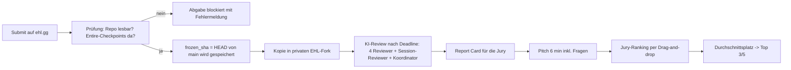

# So bewertet die EHL: alle Mechaniken, belegt am Quellcode

> Stand: Recherche am 09.10.2026 gegen `github.com/tum-ai/ehl`, Commit `5afdadb` (03.10.2026).
> Codeverweise im Format `datei:zeile`. Was nicht im Code steht, ist als **UNBESTÄTIGT** markiert.

## Die Kurzfassung in 10 Sätzen

1. **Die Platzierung bestimmen Menschen.** Jede Jurorin und jeder Juror sortiert alle Teams der Challenge per Drag-and-drop. Die Plattform mittelt die Plätze, bei Gleichstand gewinnt das Team mit mehr Stimmen (`lib/actions/jury.ts:20-41`).
2. **Der KI-Report ist nur eine Lesehilfe für die Jury.** Er fließt nicht automatisch in die Platzierung ein (`docs/FEATURES.md:483-487`: „Visible to jury members for informed decision-making“).
3. **Die Jury sieht pro Team:** Challenge-Text, Teamlogo, Projektname, Kurzbeschreibung, Tech-Stack-Badges, Links (Repo, Demo), **das hochgeladene Pitch-Deck eingebettet** und den KI-Report (`app/jury/[chapter-slug]/submission/[id]/page.tsx`).
4. **Pitch-Deck ist standardmäßig Pflichtfeld** (PDF/PPTX), dazu Repo (Pflicht) und Live-Demo-Link (optional) (`supabase/migrations/00003_phase2_schema.sql:33-37`). Die Felder kann der Organisator pro Challenge ändern.
5. **Reviewt wird genau der Commit, der beim Klick auf „Submit“ oben auf `main` liegt** (`lib/submission-snapshots/prepare.ts:162-180`). Später gepushter Code zählt NICHT automatisch: Nach jedem Push muss jemand **„Update Submission“** klicken (`docs/FEATURES.md:357-360`).
6. **Der Snapshot ist der GitHub-Zipball dieses Commits** (`lib/code-review/archive.ts:52`). Wir haben getestet: Er **beachtet `export-ignore`** (siehe unten).
7. **Der KI-Reviewer liest höchstens ~200.000 Zeichen** (50.000 Tokens × 4), README und Manifeste zuerst, dann die **kleinsten Dateien zuerst** (`lib/code-review/ingest.ts:223-279`).
8. **Ohne Entire-Checkpoints kann man nicht abgeben**, wenn die Challenge Entire verlangt (Standard seit Migration 00051) (`prepare.ts:167-178`).
9. **Der Entire-Session-Reviewer ist nur ein Bonus** und ändert die Platzierung nie (`lib/code-review/prompts.ts:222-235`).
10. **Prompt-Injection wird erkannt und als Anomalie notiert.** Niemals versuchen (`prompts.ts:84, 255, 342`).

## 1. Ablauf von der Abgabe bis zur Platzierung



## 2. Die Abgabe (Submit)

| Punkt | Was der Code macht | Beleg |
|---|---|---|
| Welcher Branch | Default-Branch des Repos (bei uns `main`) | `prepare.ts:158-165` |
| Welcher Commit | HEAD des Default-Branches im Moment des Submit | `prepare.ts:162-180` |
| Mehrfach abgeben | erlaubt; jedes Update speichert einen neuen eingefrorenen Stand | `FEATURES.md:357-360` |
| Später Push | wird **nie** automatisch übernommen | `FEATURES.md:358-360` |
| Private Repos | Bot `ehl-gg` braucht Zugriff; offene Einladungen nimmt die Plattform selbst an | `prepare.ts:153-154` |
| Entire-Pflicht | Checkpoint-Refs müssen existieren und mindestens 1 Prompt enthalten | `prepare.ts:167-178`, `lib/entire.ts:391, 539` |
| Formularfelder | `project_name`, `short_description`, `fields` (Repo, Deck, Demo …), `tech_stack` | `lib/submission-snapshots/types.ts:10-20` |
| Deadline | harte Sperre; späte Retries behalten den letzten akzeptierten Stand | `FEATURES.md:357-364` |

**Konsequenz für uns:** Alles, was die Jury sehen soll, muss vor dem Submit **in `main` gemergt** sein. Feature-Branches sieht der Reviewer nicht.

## 3. Der Zipball und `export-ignore`: unser Test

GitHub erzeugt Zipballs mit `git archive`, und das lässt Pfade mit `export-ignore` aus `.gitattributes` weg. Wir haben das **am eigenen Repo bewiesen**:

```text
$ gh api repos/PiyushPapaya/TUMHackathon26/zipball/b52ee3c0d5fd349befaf7b2f05afb9bb23b47086
13 Dateien im Zipball: .claude/settings.json, .env.example, .gitattributes, .github/CODEOWNERS,
.gitignore, CLAUDE.md, README.md, demo/.gitkeep, docs/ARCHITEKTUR.md, docs/SETUP.md, src/…, tests/.gitkeep
docs/wissen enthalten? False
team/ enthalten? False
```

**Restrisiko:** Für ganz alte Abgaben (Revision 0) liest `ingest.ts:164-169` stattdessen über die GitHub-Trees-API, und die ignoriert `export-ignore`. Neue Abgaben haben immer einen `frozen_sha` und nutzen den Zipball. `python scripts/ehl_budget.py --modus baum` zeigt den schlechtesten Fall.

## 4. Was der KI-Reviewer von unserem Code sieht (Ingestion)

| Regel | Detail | Beleg |
|---|---|---|
| Dateien > 50.000 Bytes | fliegen raus (z. B. `package-lock.json`) | `archive.ts:32`, `ingest.ts:219` |
| Binärdateien | fliegen raus | `archive.ts:38` |
| Relevante Endungen | Code-Endungen + `json yaml yml toml md prisma graphql proto` | `ingest.ts:42-44` |
| Relevante Dateinamen | `README.md`, `package.json`, `requirements.txt`, `Dockerfile`, `.env.example`, `Makefile` … | `ingest.ts:46-51` |
| Ignorierte Ordner | `node_modules .next dist build .git vendor __pycache__ .venv venv target coverage .cache .husky .idea .vscode out .turbo` (überall im Pfad!) | `ingest.ts:53-57, 131-134` |
| Reihenfolge | erst `README.md package.json requirements.txt Cargo.toml go.mod Dockerfile tsconfig.json` (**egal in welchem Ordner**), dann **kleinste Datei zuerst** | `ingest.ts:223-236` |
| Kappung | nur wenn > 8.000 Zeichen **und** > 200 Zeilen → erste 200 Zeilen | `ingest.ts:262-267` |
| Budget | 50.000 Tokens × 4 = 200.000 Zeichen, letzte Datei wird abgeschnitten | `ingest.ts:241, 269-272` |
| Frameworks | **nur** aus `package.json` und `requirements.txt` im **Repo-Root** | `ingest.ts:87, 104-112` |
| Flags | `has_readme`, `has_dockerfile`, `has_tests` (jeder Ordner namens `tests`, `test`, `e2e` …) | `ingest.ts:209-212` |
| Commit-Anzahl | im Snapshot-Modus immer **0** (der Reviewer sieht keine Historie) | `ingest.ts:175` |

**Was daraus folgt:**
- Achtung, Fallen: Ordner namens `out/` oder `build/` werden komplett ignoriert, auch wenn darin echter Code liegt. Jede Datei namens `README.md` wird nach vorne gezogen.
- Die wichtigste Logik gehört in **mittelgroße, gut benannte Dateien**. Riesige Dateien werden nach 200 Zeilen gekappt; den Rest sieht der Reviewer nie.
- `requirements.txt` gehört **in den Repo-Root**, damit FastAPI erkannt wird. Next.js wird nur erkannt, wenn die Root-`package.json` `next` als Dependency hat (siehe [STACK.md](STACK.md)).
- Prüfen mit `python scripts/ehl_budget.py`.

## 5. Der KI-Report (Report Card)

Fünf LLM-Aufrufe über OpenRouter, Temperatur 0 (`lib/code-review/pipeline.ts:26-46`):

| Teil | Modell (Standard) | Liefert (exakte JSON-Felder) | Beleg |
|---|---|---|---|
| A Tech-Beschreibung | gemini-2.5-flash | `project_summary`, `tech_stack`, `tech_stack_reasoning`, `architecture_pattern`, `key_dependencies` | `prompts.ts:72-100` |
| B Code-Qualität | claude-sonnet-4.5 | `readability`, `structure`, `error_handling`, `best_practices`, `overall_code_quality` je `{score 1-10, rationale}`; 5 = ok für Hackathon, 7+ = beeindruckend, ≤3 = deutliche Probleme | `prompts.ts:104-134` |
| C Highlights & Probleme | claude-sonnet-4.5 | 2-5 `highlights` (Datei, Zeile, warum), 2-5 `concerns` (Datei, `severity` low/medium/high/critical), `would_it_run` (yes/probably/unlikely/no + Begründung) | `prompts.ts:138-183` |
| D Originalität | gemini-2.5-flash | `boilerplate_ratio`, `custom_code_ratio`, Indikatoren, `git_activity_assessment`, `assessment`. Typisch 0,3-0,5 Boilerplate. **Keine KI-Erkennung.** | `prompts.ts:187-218` |
| Koordinator | claude-sonnet-4.5 | `executive_summary`, `scores` (code_quality 30, architecture 25, challenge_alignment 25, innovation 20), `weighted_total`, 2-4 Highlights/Concerns, **exakt 3 Stärken + 3 Schwächen**, `notable_patterns` | `prompts.ts:325-397` |

Wichtige Details:
- Gewichte, Modelle und **zusätzliche Review-Instruktionen** können pro Challenge anders sein (`pipeline.ts:48-56`, `prompts.ts:35-37`). Den Challenge-Text und das Brief-Dokument bekommt jeder Reviewer mit (`prompts.ts:6-40`). **Challenge-Alignment wird gegen den Brief-Text gemessen**, deshalb gehört eine Alignment-Map in die README.
- `git_activity_assessment` wird abgefragt, aber **nicht** in den Report übernommen (`pipeline.ts:320, 349-353`). Die Form der Commit-Historie ist für den KI-Report praktisch egal.
- Der Koordinator sieht nur die Texte der vier Reviewer, nicht den Code (`prompts.ts:376-395`).

## 6. Der Entire-Session-Reviewer (Bonus, beratend)

| Kriterium | Gewicht | Was zählt |
|---|---|---|
| `ownership_language` | 35 | „Wir nehmen X, weil …; Y verworfen, weil …“ statt „die KI hat gebaut“ |
| `technical_specificity` | 25 | konkrete Prompts mit Constraints, Edge Cases, Architektur |
| `iteration_verification` | 25 | testen, prüfen, debuggen statt blind übernehmen |
| `edge_case_awareness` | 15 | Fehlerfälle, Sicherheit, Grenzen |

Dazu `completeness`: Erklärt die Historie den Code plausibel (berührte Dateien ↔ Repo, Themen ↔ Stack)? Signierte Commits erhöhen das Vertrauen (`prompts.ts:253-293`). Formel: `bonus = (own·35 + spec·25 + iter·25 + edge·15)/100`, die meisten Teams liegen bei 4-7.

**Wichtiger Fund im Code:** `ingestSessionHistory` liest nur den **ersten nicht-leeren Checkpoint-Tree** und maximal **40 Prompts à 4.000 Zeichen** (`lib/entire.ts:570-587`). Die Checkpoint-Refs heißen `refs/entire/checkpoints/<2 Zeichen>/<ID>`, sortiert nach diesen zwei Zeichen, also praktisch zufällig. **Jede einzelne Session kann die sein, die bewertet wird.** Deshalb gilt die Ownership-Sprache für alle fünf, in jedem Prompt.

## 7. Entire-Pflicht: was genau geprüft wird

- Gesucht wird unter `refs/entire/checkpoints/*/*` (aktuelles Format) und als Fallback `entire/checkpoints/v1` (`lib/entire.ts:40-55`).
- Bestanden, wenn mindestens ein Checkpoint mit Prompt, Metadaten oder Transcript existiert (`entire.ts:391, 539`).
- Obergrenze: 2.000 Checkpoint-Refs bei der Abgabe (`lib/config/limits.ts:23`). Für 24 Stunden ist das unkritisch.
- Die Checkpoint-Refs sind **eigene Git-Refs** und hängen nicht an Branch-Commits. Sie werden beim `git push` automatisch mitgeschickt (`[entire] Pushing 1 checkpoint ref(s) to origin… done`). Squash-Merges zerstören sie nicht, würden aber den `Entire-Checkpoint`-Trailer in der Commit-Message auf `main` verwischen. Deshalb erlauben wir nur Merge-Commits.
- „Signed“ heißt: GitHub zeigt den Commit als *Verified* an (`entire.ts:651-664`). Das ist nur ein Vertrauensbonus und wird nie verlangt.
- Fehlermeldungen unterscheiden drei Fälle: Repo nicht lesbar / keine Checkpoints / keine Prompts (`entire.ts:139-173`).

## 8. Wertung und Preise

- Platz 1-5 einer Challenge geben League-Punkte 8/7/6/4/4, Abgeben allein 2 Punkte (`lib/scoring.ts:3-11`). Für uns ohne League-Ambition zählt nur **Platz 1 der Challenge-Jury** (1.500 €, laut Event-Guide).
- Die Jury-Rankings sind INSERT-only und nicht änderbar (`FEATURES.md` „Ranking“).
- Pitch-Reihenfolge wird zufällig erzeugt (`FEATURES.md` „Pitch Order“).

## 9. Regeln zu vorab vorbereitetem Code und KI

- ehl.gg/rules: Teams mit 2-5 Personen, „Cheating, plagiarism, or any form of misconduct will result in disqualification“. **Zu vorab geschriebenem Code, Templates und KI-Nutzung steht dort nichts** (Abruf 09.10.2026).
- KI-Nutzung ist offensichtlich gewollt (Entire-Pflicht, OpenAI als Partner, Originalitäts-Reviewer erkennt bewusst keine KI).
- **Unsere Linie:** Vor dem Event nur Tooling, Doku und Templates, **kein Produkt-Code**. Am Samstag scaffolden wir frisch. **UNBESTÄTIGT**, ob vorab gescaffoldeter Code erlaubt wäre. Frage im Discord oder am Check-in.

## 10. Was wir daraus ableiten (Taktik)

1. **Die menschliche Jury gewinnen.** Ihr Urteil entsteht in 6 Minuten Pitch und Demo plus dem eingebetteten Pitch-Deck.
2. Den **Report** als Rückenwind nutzen: README mit Zahl, Mermaid-Diagramm und Alignment-Map; lauffähig („would it run: yes“); Tests vorhanden; keine Secrets.
3. **Budget schützen:** Doku per `export-ignore` raus, Produkt-Code rein (Nachweis mit `ehl_budget.py`).
4. **Entire sauber:** alle fünf mit `entire enable`, Ownership-Sprache in jedem Prompt.
5. **Submit früh und oft**, nach jedem Merge „Update Submission“, letzter Klick bis 11:30.
