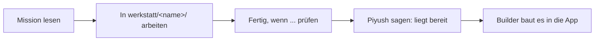

# Missionen

Eine Mission ist eine kleine Bauaufgabe, die am Ende in der Demo oder im Pitch zu sehen ist. Kein Code nötig, außer bei "Builder".

| Mission | Ziel in einem Satz | Code nötig? | Vorschlag für |
|---|---|---|---|
| [Daten-Detektiv](daten-detektiv.md) | Die stärksten Kundenthemen und Zitate von Hand finden und mit der KI vergleichen | nein | Aditya |
| [Prompt-Designer](prompt-designer.md) | Die Prompts für Anforderungen und Challenge verbessern | nein | Dennis |
| [Wettbewerbs-Scout](wettbewerbs-scout.md) | Mercedes, Audi, Tesla und Lucid zu unseren Top-Themen mit Quellen recherchieren | nein | wer mag |
| [Visual-Designer](visual-designer.md) | Diagramme, Mockups und Charts für Pitch und App | nein | Lasse |
| [Story & Pitch](story-und-pitch.md) | Demo-Story, Folien, Jury-Fragen, Pitch üben | nein | Piyush |
| [Baukasten](../src/frontend/baukasten/README.md) | Texte, Farben, Feature-Schalter und angepinnte Zitate der Werkbank ändern | nein | alle |
| [Builder](builder.md) | Pipeline und App, alles von den anderen einbauen | ja, mit Claude Code | Piyush, Lasse |

## So läuft jede Mission

- Dein Ergebnis liegt zuerst in `werkstatt/<name>/`. Dort kannst du nichts kaputt machen.
- Wenn die Mission "Fertig, wenn ..." erfüllt, sag es Piyush. Er (oder Claude) baut es ein.
- Jede Entscheidung in einer Mission (z. B. "wir nehmen Thema X, weil ...") schreibst du in eine Zeile in `werkstatt/<name>/notizen.md`. Die Jury-KI bewertet eigene, begründete Entscheidungen.

## Mit Claude Code arbeiten (ohne Code)

Öffne Claude Code im Repo-Ordner und schreib nach dieser Formel: **Was + Warum + Was verworfen + Wie prüfen.**

Beispiel:
> Ich will die 20 häufigsten Kritik-Themen beim G60 USA finden, weil wir daraus Anforderungen ableiten. Ich will nicht alle Kommentare lesen, nur die Gruppen nach BMW-Thema. Zeig mir das Ergebnis als Tabelle, damit ich es mit Excel prüfen kann.

Nicht so: "Mach das mal."
